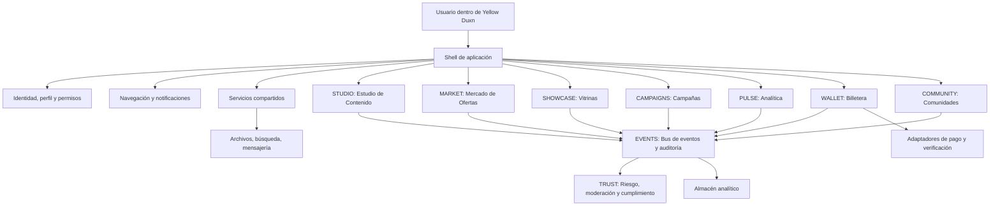
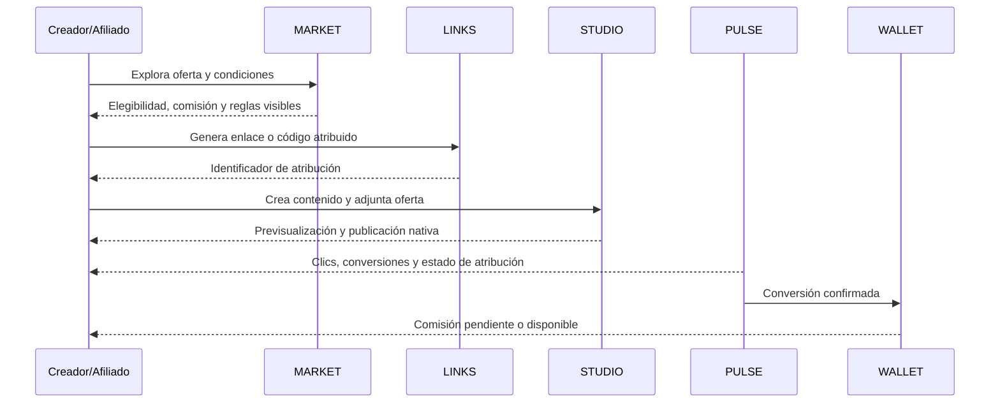

# Arquitectura funcional de herramientas nativas para Yellow Duxn

**Estado:** Diseño conceptual y técnico inicial  
**Producto:** Yellow Duxn, anteriormente Yellow Duck  
**Objetivo:** Incorporar herramientas de creación, venta, afiliación, medición y comunidad dentro de una única aplicación web y móvil, sin exigir la instalación de aplicaciones adicionales.

> **Principio rector:** Cada herramienta debe sentirse como una capacidad propia de Yellow Duxn, aunque internamente se implemente como un módulo autónomo, versionable y reemplazable.

## 1. Alcance y separación propuesta

La propuesta no crea productos externos ni obliga a los usuarios a alternar entre aplicaciones. En cambio, define una **Suite Nativa Yellow Duxn** compuesta por módulos con responsabilidades delimitadas. Todos comparten sesión, perfil, permisos, notificaciones, diseño visual y datos mínimos comunes; cada uno conserva sus propias reglas de negocio, interfaces de programación y almacenamiento lógico.

| Capa | Responsabilidad | Regla de separación |
|---|---|---|
| **Núcleo Yellow Duxn** | Identidad, perfiles, red social, navegación, permisos, notificaciones y configuración global. | No debe contener cálculos de comisión, lógica editorial ni reglas de campañas. |
| **Suite Nativa** | Herramientas de negocio disponibles desde la aplicación: contenido, ofertas, afiliación, comercio, campañas, analítica y recompensas. | Cada herramienta es un módulo de dominio con rutas, datos y servicios propios. |
| **Servicios compartidos** | Buscador, archivos, mensajería, eventos, auditoría, moderación, diseño y observabilidad. | Exponen contratos internos estables; no conocen la lógica particular de cada módulo. |
| **Conectores opcionales** | Pagos, logística, verificación de identidad, analítica externa o proveedores de IA. | Son adaptadores del servidor. Nunca se presentan al usuario como una app que deba instalar. |

Esta división permite activar una herramienta por fases, mantenerla o sustituirla sin reescribir la red social. El usuario final solo ve una experiencia continua: menú, panel personal y acciones contextuales dentro de Yellow Duxn.

## 2. Objetivos de producto

Yellow Duxn debe permitir que un creador, afiliado, marca o comunidad complete el ciclo de valor desde el mismo ecosistema: descubrir una oportunidad, preparar contenido, obtener un enlace o vitrina, compartirlo, medir resultados y consultar sus ganancias. La plataforma debe mostrar las reglas de atribución y comisiones antes de que una persona promocione una oferta, evitando incentivos opacos o promesas de rentabilidad.

| Objetivo | Resultado verificable |
|---|---|
| **Cero descargas adicionales** | Creación, publicación, seguimiento, analítica y consulta de saldo funcionan en las interfaces web y móvil de Yellow Duxn. |
| **Economía transparente** | Cada venta, comisión, ajuste o retiro deja un movimiento visible y auditable para las partes autorizadas. |
| **Integración social real** | Las publicaciones, mensajes, perfiles y comunidades pueden enlazar campañas y vitrinas sin duplicar datos. |
| **Modularidad** | Los módulos pueden desplegarse, probarse o desactivarse independientemente mediante banderas de funcionalidad. |
| **Escalado responsable** | Métricas, prevención de fraude, moderación y controles de cumplimiento están presentes desde el diseño. |

## 3. Mapa de módulos nativos

La suite se organiza en ocho módulos de usuario y tres módulos transversales. Los módulos de usuario son independientes en su código y modelo de dominio, pero aparecen unidos dentro de la experiencia de navegación de Yellow Duxn.

| Código | Módulo nativo | Usuario principal | Propósito dentro de la aplicación |
|---|---|---|---|
| **STUDIO** | Estudio de Contenido | Creador, afiliado, marca | Preparar publicaciones, historias, videos breves, piezas de campaña y llamados a la acción. |
| **MARKET** | Mercado de Ofertas | Afiliado, creador, marca | Descubrir, crear y administrar productos, servicios, campañas y sus condiciones. |
| **LINKS** | Enlaces y Atribución | Afiliado, creador | Generar enlaces, códigos, códigos QR y parámetros de seguimiento compatibles con una oferta. |
| **SHOWCASE** | Vitrina y Mini-tienda | Afiliado, creador, comunidad | Agrupar recomendaciones, colecciones y ofertas aprobadas en una página nativa compartible. |
| **CAMPAIGNS** | Centro de Campañas | Marca, gestor, equipo | Definir objetivos, materiales, reglas, participantes, tareas y presupuesto de una campaña. |
| **PULSE** | Analítica de Impacto | Todos los roles de negocio | Mostrar alcance, clics, conversiones, ventas, atribución, comisiones y tendencias. |
| **WALLET** | Billetera y Recompensas | Todos los usuarios elegibles | Presentar saldo, movimientos, comisiones pendientes, ajustes, requisitos y solicitudes de retiro. |
| **COMMUNITY** | Comunidades de Impulso | Líderes, afiliados y equipos | Organizar retos, co-promociones, aprendizaje y reconocimiento, sin esquemas de reclutamiento opacos. |
| **TRUST** | Confianza, cumplimiento y moderación | Sistema y administradores | Gestionar consentimiento, KYC cuando sea necesario, disputas, fraude, contenido y restricciones. |
| **EVENTS** | Eventos y auditoría | Sistema | Publicar eventos de dominio y conservar trazabilidad de acciones sensibles. |
| **DESIGN** | Sistema de diseño y experiencia | Producto y desarrollo | Garantizar controles, estados, accesibilidad, traducciones y consistencia visual. |

## 4. Arquitectura de integración

Cada módulo será una unidad de interfaz y servicio con un manifiesto común. El núcleo solo necesita saber qué rutas, permisos, entradas del menú, eventos y capacidades ofrece el módulo. La lógica interna permanece encapsulada.

### 4.1 Contrato de módulo

Cada herramienta debe declararse mediante un manifiesto interno equivalente a la siguiente estructura conceptual. Esta interfaz impide que los módulos modifiquen el núcleo directamente y facilita una integración gradual.

| Campo | Ejemplo | Uso |
|---|---|---|
| `id` | `market` | Identificador estable del módulo. |
| `version` | `1.0.0` | Control de compatibilidad y despliegue. |
| `routes` | `/ofertas`, `/ofertas/:id` | Vistas propiedad del módulo. |
| `navigation` | `Explorar ofertas` | Elementos que el shell puede mostrar según permiso. |
| `permissions` | `offers.read`, `offers.create` | Autorización centralizada. |
| `eventsPublished` | `offer.published` | Eventos emitidos hacia los demás módulos. |
| `eventsConsumed` | `profile.verified` | Eventos aceptados sin acceso directo a las bases ajenas. |
| `featureFlags` | `native_market_v1` | Activación gradual, pruebas y reversión segura. |

### 4.2 Principios de datos y seguridad

Los módulos son dueños de sus tablas y reglas. Por ejemplo, MARKET posee ofertas y condiciones; LINKS posee enlaces y toques de atribución; WALLET posee el libro mayor de movimientos. Todos utilizan un identificador de usuario común y un identificador de organización cuando corresponda. Ningún módulo debe alterar de forma directa los datos financieros, de atribución o de otro módulo.

Las operaciones que puedan afectar dinero, visibilidad pública, comisiones, atribución o reputación deben generar un evento de auditoría inmutable. Los importes se registran con moneda y precisión explícitas; la billetera trabaja con un **libro mayor de doble entrada** y estados de disponibilidad, no con un único número editable de saldo.

## 5. Roles y permisos base

Los roles no sustituyen permisos granulares, pero simplifican la primera experiencia. Una misma cuenta puede tener más de un rol en contextos distintos.

| Rol | Capacidades iniciales |
|---|---|
| **Miembro** | Consumir contenido, seguir perfiles, comprar, guardar ofertas y participar en comunidades. |
| **Creador/Afiliado** | Crear contenido, solicitar acceso a ofertas, generar enlaces, mantener vitrinas y consultar métricas y comisiones propias. |
| **Marca/Vendedor** | Crear ofertas, definir campañas y comisiones, aportar materiales, aprobar participantes y revisar resultados. |
| **Gestor de equipo** | Operar campañas y comunidades autorizadas, sin controlar el dinero personal de otros usuarios. |
| **Moderador/Operaciones** | Resolver reportes, administrar criterios de publicación y revisar anomalías bajo permisos auditados. |
| **Finanzas/Administración** | Gestionar ajustes y pagos conforme a flujos de aprobación separados. |

## 6. Recorrido nativo de valor

El flujo principal debe unir los módulos sin abrir una aplicación diferente. Desde una publicación o perfil, el afiliado puede abrir una oferta, leer sus condiciones, solicitar acceso si es necesaria una aprobación, crear una pieza de contenido, adjuntar un enlace rastreable, publicar y observar el rendimiento en su panel. Cuando existe una conversión confirmada, la comisión aparece primero como pendiente, después como disponible conforme a la política explícita de la oferta.

## 7. Límites explícitos de la primera versión

La primera versión debe priorizar una economía de afiliación verificable sobre funciones llamativas pero inseguras. Se excluyen del alcance inicial las promesas de ingresos, el cálculo de comisiones en cadena, la creación automática de pagos sin validación y cualquier mecánica que premie únicamente por reclutar personas. Si en el futuro se habilitan pagos, identidad o facturación, esos servicios se conectarán desde el servidor mediante adaptadores y con una experiencia integrada en la aplicación.

La arquitectura queda preparada para construir cada módulo en un repositorio o paquete separado, e integrarlo al shell de Yellow Duxn cuando el núcleo de la aplicación esté disponible. El repositorio actual no contiene código base, por lo que este documento define el contrato de partida sin imponer un lenguaje o marco de desarrollo.

## 8. Decisiones pendientes

| Decisión | Alternativas a validar | Impacto |
|---|---|---|
| Modelo comercial | Marketplace abierto, ofertas por invitación o modelo híbrido | Elegibilidad, moderación y descubrimiento. |
| Método de atribución | Enlace, código, cupón, combinación o atribución multitoque | Cálculo de comisión y claridad para usuarios. |
| Pago de comisiones | Saldo interno, integración con proveedor o retiro manual asistido | Cumplimiento normativo y experiencia de billetera. |
| Territorio inicial | Un país, una región o lanzamiento internacional | Moneda, impuestos, privacidad e identidad. |
| Tipos de oferta | Productos físicos, digitales, servicios o todos | Datos de catálogo, devoluciones y logística. |
| Política de comunidad | Retos y colaboración, con reglas anti-spam y anti-reclutamiento | Confianza y sostenibilidad de la red. |

---

**Siguiente documento:** `diseno-modulos-y-flujos-yellow-duxn.md`, con pantallas, estados, acciones y contratos de integración de cada herramienta.
