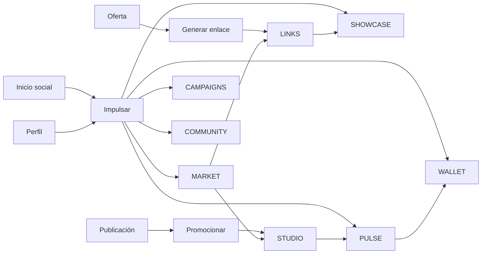

# Diseño separado de módulos y flujos nativos

**Producto:** Yellow Duxn  
**Alcance:** Diseño de experiencia y comportamiento de la Suite Nativa, separado del núcleo de la red social.  
**Convención:** Las herramientas se abren dentro de la aplicación; no requieren instalaciones, extensiones ni ventanas de terceros.

## 1. Patrón de experiencia común

Cada módulo conserva una identidad funcional, pero adopta el mismo lenguaje visual de Yellow Duxn. La persona no debe sentir que cambia de producto al pasar de una publicación a una oferta, de una oferta a su vitrina o de una conversión a la billetera. Las transiciones conservan el contexto, el botón de regreso y la misma cuenta activa.

| Elemento de experiencia | Diseño requerido | Propósito |
|---|---|---|
| **Centro de herramientas** | Entrada “Impulsar” en la navegación principal; muestra accesos habilitados según rol. | Evitar aplicaciones externas y menús dispersos. |
| **Acciones contextuales** | Botones “Promocionar”, “Añadir a vitrina”, “Ver campaña” y “Ver ganancias” en publicaciones, perfiles y ofertas. | Acercar el trabajo al momento social correcto. |
| **Espacio de trabajo** | Barra superior con nombre del módulo, selector de organización, búsqueda y notificaciones; menú lateral propio del módulo. | Dar orientación sin romper el shell principal. |
| **Panel personal** | Resumen de actividad, tareas, métricas y alertas visibles desde “Mi impulso”. | Reducir pasos para usuarios que comienzan. |
| **Estados obligatorios** | Carga, vacío, sin permiso, revisión, error recuperable, éxito y archivo. | Diseñar una experiencia confiable, no solo el caso ideal. |
| **Accesibilidad** | Etiquetas claras, foco de teclado, contraste suficiente, texto alternativo y datos no expresados solo por color. | Mantener las herramientas utilizables por más personas. |

> **Regla de diseño:** La comisión, elegibilidad, atribución y estado de pago siempre deben estar descritos en texto; no deben inferirse a partir de un icono, un color o una estimación ambigua.

## 2. Navegación de la Suite Nativa

La entrada “Impulsar” vive en la navegación de Yellow Duxn y dirige al panel que corresponda al rol y contexto. En móvil se presenta como una pestaña de primer nivel o acción central; en escritorio se presenta en la barra lateral principal. Ninguna ruta abre una aplicación o dominio de trabajo distinto.

| Ruta nativa | Módulo propietario | Vista inicial | Usuarios previstos |
|---|---|---|---|
| `/impulsar` | Shell | Panel “Mi impulso” | Todos los usuarios elegibles. |
| `/ofertas` | MARKET | Catálogo y filtros | Miembros, creadores y marcas. |
| `/crear` | STUDIO | Selector de formato y borradores | Creadores, afiliados y marcas. |
| `/vitrina/:alias` | SHOWCASE | Vitrina pública nativa | Visitantes y seguidores. |
| `/campanas` | CAMPAIGNS | Tablero de campañas | Marcas y gestores. |
| `/resultados` | PULSE | Resumen de rendimiento | Roles de negocio. |
| `/billetera` | WALLET | Saldo y movimientos | Usuarios con actividad económica. |
| `/comunidades` | COMMUNITY | Descubrimiento y actividad | Todos los usuarios. |

## 3. Módulos de usuario

### 3.1 STUDIO — Estudio de Contenido

STUDIO permite crear contenido publicable sin abandonar Yellow Duxn. No es solo un editor: entiende el objetivo comercial y permite vincular una oferta o una campaña de forma explícita. El contenido puede ser una publicación estándar, historia, video breve, carrusel, recomendación de vitrina o actualización de comunidad, sujeto a las capacidades que active el producto.

| Área | Diseño funcional |
|---|---|
| **Inicio** | Tarjetas “Crear desde cero”, “Usar plantilla”, “Promocionar una oferta”, “Continuar borrador” y “Material de campaña”. |
| **Lienzo de creación** | Editor de texto, cargador de medios, portada, etiquetas, accesibilidad, vista previa y selector de visibilidad. |
| **Panel de impulso** | Buscador de oferta/campaña, resumen de comisión, condiciones, llamada a la acción y enlace atribuido adjunto. |
| **Revisión antes de publicar** | Lista de comprobación: derechos del material, divulgación comercial, enlace válido, público, fecha y cumplimiento de campaña. |
| **Biblioteca** | Borradores, publicados, programados, archivados y plantillas propias. |

El usuario entra desde “Crear”, desde la ficha de una oferta o desde una campaña. Si llega desde una oferta, el panel de impulso ya trae esa oferta seleccionada y muestra sus reglas antes de que pueda publicar. Si la oferta exige aprobación, el CTA se transforma en “Solicitar participación”; no se permite crear un enlace de comisión hasta que la solicitud sea aprobada.

| Estado | Mensaje y acción de diseño |
|---|---|
| Sin oferta seleccionada | “Puedes publicar normalmente o conectar una oferta para medir el impacto.” Acción: “Explorar ofertas”. |
| Oferta no elegible | Se explica el requisito pendiente y se dirige a la solicitud o a alternativas elegibles. |
| Enlace vencido | Se bloquea la publicación comercial y se ofrece regenerarlo desde LINKS. |
| Publicación en revisión | El usuario conserva el borrador, ve el criterio aplicable y recibe notificación al resolverse. |
| Publicación aprobada | Se muestran acciones “Ver publicación”, “Compartir” y “Ver resultados”. |

**Eventos publicados:** `content.draft_saved`, `content.published`, `content.archived`, `content.offer_attached`.  
**Dependencias:** perfil, archivos, MARKET, LINKS, moderación y notificaciones.

### 3.2 MARKET — Mercado de Ofertas

MARKET reúne oportunidades promocionables, productos, servicios y campañas. La ficha de una oferta debe mostrar información suficiente para decidir antes de compartirla: descripción, reglas de elegibilidad, comisión o modelo de recompensa, duración de la atribución, restricciones, inventario o disponibilidad cuando aplique, política de devoluciones y estado de la marca.

| Pantalla | Componentes y acciones |
|---|---|
| **Explorar** | Buscador, categorías, filtros de tipo, elegibilidad, región, modelo de recompensa, comisión visible y guardados. |
| **Ficha de oferta** | Resumen de producto, condiciones, recursos creativos, preguntas frecuentes, reputación de marca y acciones “Solicitar”, “Generar enlace” o “Crear contenido”. |
| **Mis oportunidades** | Solicitudes pendientes, aprobadas, pausadas, vencidas y guardadas. |
| **Crear oferta** | Asistente por pasos para marca: datos de oferta, condiciones, atribución, público, materiales, revisión y publicación. |
| **Gestión de oferta** | Estado, participantes, recursos, métricas resumidas, ediciones versionadas y suspensión. |

La etiqueta de recompensa debe expresar si es porcentaje, importe fijo u otra modalidad. Cuando el valor pueda variar, se muestra el rango, condición y ejemplo de cálculo; no se muestra una “ganancia estimada” como resultado garantizado.

| Flujo de afiliado | Resultado esperado |
|---|---|
| Explorar → abrir ficha → leer reglas → guardar | Oferta queda disponible en “Mis oportunidades”. |
| Solicitar participación → completar requisitos → enviar | Solicitud auditable; estado “En revisión” con fecha y reglas. |
| Aprobación → generar enlace → crear pieza | El afiliado puede impulsar solo bajo las condiciones aprobadas. |
| Oferta suspendida | Se detienen nuevos enlaces y publicaciones comerciales; las atribuciones previas siguen sus condiciones documentadas. |

**Eventos publicados:** `offer.created`, `offer.published`, `offer.updated`, `affiliate.application_submitted`, `affiliate.application_approved`, `offer.paused`.

### 3.3 LINKS — Enlaces y Atribución

LINKS vive como una herramienta simple, pero su diseño exige precisión: crear identificadores de atribución, controlar su vigencia y explicar su alcance. Se accede desde una oferta, STUDIO, SHOWCASE o la sección “Mis enlaces” dentro de “Impulsar”.

| Función | Diseño dentro de la aplicación |
|---|---|
| **Crear enlace** | Oferta preseleccionada, nombre interno, canal, campaña, fecha de vigencia y previsualización de destino. |
| **Código de recomendación** | Identificador corto legible, criterios de uso y botón de copia; evita exponer datos personales. |
| **Código QR** | Generación visual para descargar o compartir desde el navegador, asociado al mismo identificador. |
| **Gestión** | Lista de enlaces activos, pausados, vencidos y archivados con filtros y etiquetas. |
| **Detalle** | Clics, conversiones atribuidas, última actividad, condiciones vigentes y acciones de pausar o regenerar. |

El enlace no revela la comisión de otra persona ni permite cambiar unilateralmente reglas de una oferta. Los cambios de atribución relevantes se versionan y se muestran como aviso dentro del detalle del enlace.

**Eventos publicados:** `attribution.link_created`, `attribution.link_clicked`, `attribution.code_used`, `attribution.link_paused`.

### 3.4 SHOWCASE — Vitrina y Mini-tienda nativa

SHOWCASE permite que cada creador, afiliado o comunidad organice recomendaciones en una página nativa de Yellow Duxn. La vitrina se abre dentro de la aplicación y puede compartirse mediante un enlace web normal; quien la visita no instala nada adicional.

| Componente | Diseño |
|---|---|
| **Cabecera** | Foto, nombre, declaración comercial cuando haya enlaces de afiliación, biografía y botones de seguir/mensajería. |
| **Colecciones** | Grupos curados como “Favoritos”, “Campaña de verano” o “Para principiantes”, con orden configurable. |
| **Tarjeta de oferta** | Imagen, nombre, descripción breve, precio cuando aplique, disponibilidad, llamada a la acción y divulgación. |
| **Edición** | Reordenar, añadir/quitar ofertas elegibles, redactar introducciones, definir visibilidad y vista previa. |
| **Rendimiento** | Visitas, clics, conversiones atribuidas y datos agregados; no muestra información personal de compradores. |

La edición debe impedir añadir ofertas suspendidas, vencidas o no autorizadas. Para evitar conversiones engañosas, cualquier beneficio económico se divulga de manera visible y consistente cerca de la recomendación.

**Eventos publicados:** `showcase.created`, `showcase.published`, `showcase.item_added`, `showcase.visited`.

### 3.5 CAMPAIGNS — Centro de Campañas

CAMPAIGNS sirve a marcas y gestores que necesitan coordinar una iniciativa sin sacar a los participantes de Yellow Duxn. El módulo no es una hoja de cálculo aislada: enlaza objetivos, materiales, condiciones, personas invitadas y resultados.

| Paso del asistente de campaña | Datos esenciales |
|---|---|
| **1. Objetivo** | Nombre, periodo, audiencia, objetivo de negocio y métricas de éxito. |
| **2. Oferta y atribución** | Oferta asociada, comisión, cupón, vigencia y condiciones aplicables. |
| **3. Participantes** | Criterios, invitaciones, cupos, revisión de solicitudes y permisos. |
| **4. Materiales** | Guías, imágenes, textos aprobados, restricciones y documentos internos. |
| **5. Activación** | Tareas, fechas, presupuesto visible si aplica, notificaciones y publicación. |
| **6. Seguimiento** | Contenido asociado, participantes activos, incidencias y resultados agregados. |

Cada tarea debe identificar claramente si es obligatoria, sugerida o informativa. El gestor puede ver avance de campañas, pero no editar el contenido personal de un creador ni el saldo de su billetera.

**Eventos publicados:** `campaign.created`, `campaign.activated`, `campaign.member_invited`, `campaign.task_completed`, `campaign.closed`.

### 3.6 PULSE — Analítica de Impacto

PULSE transforma los eventos de contenido, clic, venta y comisión en decisiones comprensibles. Su primera pantalla es un resumen por periodo y contexto; desde allí se puede explorar por oferta, campaña, contenido, vitrina o enlace sin cambiar de aplicación.

| Panel | Métricas iniciales | Decisión que habilita |
|---|---|---|
| **Resumen personal** | Alcance, clics, conversiones confirmadas, comisiones pendientes/disponibles y variación por periodo. | Decidir qué contenido u oferta repetir o mejorar. |
| **Rendimiento de oferta** | Participación, clics, conversión, ventas atribuidas, devoluciones confirmadas y comisión. | Evaluar la calidad de una oportunidad. |
| **Rendimiento de contenido** | Impresiones, interacción, clics, conversiones y disclosure aplicado. | Ajustar mensaje y canal. |
| **Campaña** | Participantes, piezas publicadas, cumplimiento de tareas, resultados agregados y alertas. | Gestionar la campaña sin invadir datos personales. |
| **Atribución** | Fuente, enlace/código, estado de validación y razón de exclusión cuando exista. | Entender por qué una conversión cuenta o no. |

PULSE debe declarar la zona horaria, periodo, filtro activo y definición básica de cada métrica. Las conversiones pendientes, rechazadas o reversadas se diferencian de las confirmadas y nunca se suman silenciosamente al saldo disponible.

**Eventos consumidos:** contenido, clics, pedidos/conversiones y movimientos de billetera.  
**Eventos publicados:** `analytics.report_viewed`, `analytics.anomaly_detected`.

### 3.7 WALLET — Billetera y Recompensas

WALLET presenta una representación verificable de la actividad económica que corresponde a la cuenta. La interfaz no debe tratar el saldo como una cifra promocional; distingue el dinero pendiente, disponible, en revisión, pagado, revertido y en disputa. Los pagos o verificaciones de identidad, si son necesarios, se resuelven dentro del flujo de Yellow Duxn mediante un proveedor de servidor, no con una app adicional.

| Vista | Información y acción |
|---|---|
| **Resumen** | Disponible, pendiente, en revisión y total histórico, siempre con moneda y fecha de corte. |
| **Movimientos** | Libro de movimientos con origen, tipo, importe, estado, fecha, oferta/campaña y referencia. |
| **Detalle de comisión** | Conversión asociada, regla aplicada, etapa de validación, ajustes y enlace al caso de soporte. |
| **Retiro** | Requisitos, método registrado, importe, comisiones aplicables, confirmación y estado de solicitud. |
| **Documentos y datos** | Estado de verificación, información fiscal aplicable y consentimientos, con acceso restringido. |

Los ajustes no pueden editar un saldo directamente. Requieren un movimiento compensatorio, motivo, autor, aprobación cuando corresponda y evidencia. La interfaz de operaciones utiliza una cola diferente y deja trazabilidad completa.

**Eventos publicados:** `wallet.commission_pending`, `wallet.commission_available`, `wallet.adjustment_recorded`, `wallet.withdrawal_requested`, `wallet.payout_completed`.

### 3.8 COMMUNITY — Comunidades de Impulso

COMMUNITY convierte la red social en colaboración productiva y aprendizaje. Su diseño favorece grupos temáticos, retos transparentes, recursos y reconocimiento por contribuciones reales. No debe incluir mecanismos que premien el reclutamiento de nuevos participantes sin una actividad o venta legítima definida por las políticas de la plataforma.

| Área | Diseño |
|---|---|
| **Descubrir** | Comunidades por tema, nivel, idioma, campañas abiertas y reglas visibles antes de unirse. |
| **Espacio de comunidad** | Feed, recursos, calendario, retos, miembros, normas y moderación. |
| **Reto** | Objetivo, periodo, acciones admisibles, criterios de reconocimiento y premios no engañosos. |
| **Aprendizaje** | Guías, plantillas, sesiones y checklist de buenas prácticas, integrados al perfil de progreso. |
| **Reconocimiento** | Insignias por aporte, contenido útil, cumplimiento o colaboración; el criterio queda publicado. |

**Eventos publicados:** `community.joined`, `challenge.joined`, `challenge.completed`, `resource.saved`, `content.reported`.

## 4. Flujos de experiencia prioritarios

### 4.1 Primer impulso de un afiliado

El panel “Mi impulso” guía a la persona sin presuponer que conoce la economía de afiliación. Primero explica los criterios de elegibilidad y la divulgación comercial; después propone una oferta compatible, la creación de contenido y la consulta de resultados.

| Paso | Pantalla | Acción del usuario | Resultado visible |
|---|---|---|---|
| 1 | Mi impulso | Elegir “Encontrar una oferta” | MARKET abre con recomendaciones explicables. |
| 2 | Ficha de oferta | Leer condiciones y solicitar/acceder | Elegibilidad confirmada o requisitos claros. |
| 3 | Crear impulso | Elegir “Crear contenido” | STUDIO recibe la oferta enlazada. |
| 4 | Revisión | Confirmar divulgación, enlace y audiencia | Publicación nativa preparada. |
| 5 | Publicado | Compartir y volver al panel | PULSE comienza a mostrar métricas. |
| 6 | Resultados | Revisar estados de conversión | WALLET muestra solo los movimientos que corresponden. |

### 4.2 Activación de una campaña por una marca

La marca crea una campaña, elige una oferta existente o crea una nueva, define los términos y publica una convocatoria o invitación. Los candidatos ven los mismos términos que se usan al calcular la comisión; no se permiten condiciones ocultas por participante salvo acuerdos privados claramente identificados y aceptados.

### 4.3 Visita y compra desde una vitrina

Una persona llega a una vitrina desde el feed, el perfil o un enlace compartido. Ve quién recomienda, si existe una relación de afiliación, los productos de la colección y el destino de la oferta. La atribución se inicia sin pedir instalaciones ni registrar datos más allá de lo necesario y autorizado. Tras una conversión confirmada, PULSE y WALLET reflejan el estado de forma diferida y trazable.

## 5. Estados transversales, confianza y moderación

| Situación | Comportamiento de interfaz | Propietario funcional |
|---|---|---|
| Cuenta no verificada | Se explica qué capacidad está limitada y por qué; se ofrece continuar con tareas no restringidas. | TRUST / perfil. |
| Contenido reportado | Se preserva evidencia, se informa el estado sin revelar datos de terceros y se permite apelación. | TRUST / STUDIO. |
| Conversión en revisión | PULSE y WALLET muestran el motivo general y la fecha esperada si está disponible. | WALLET / operaciones. |
| Devolución o reverso | Se registra el cambio como un movimiento y se enlaza a la comisión relacionada. | WALLET / MARKET. |
| Oferta pausada | Se desactivan nuevas promociones y se comunica el efecto para enlaces, contenido y comisiones previas. | MARKET. |
| Fallo temporal | Se guarda el trabajo localmente cuando sea posible, se muestra reintento y se evita duplicar operaciones financieras. | Servicios compartidos. |

## 6. Reglas de comunicación y contenido comercial

Las herramientas deben enseñar buenas prácticas en el momento oportuno, no esconderlas dentro de una política extensa. Por ejemplo, al adjuntar una oferta en STUDIO se inserta una divulgación editable pero claramente marcada; al mostrar una vitrina, la relación de afiliación se ve antes de abrir la oferta; al revisar métricas, los estados de validación distinguen las conversiones confirmadas de las estimadas.

La plataforma debe evitar frases como “ingreso garantizado”, rankings basados solo en reclutamiento o incentivos que oculten condiciones relevantes. Los mensajes de recompensa utilizan lenguaje verificable: “comisión pendiente sujeta a las condiciones de la oferta”, “comisión disponible” o “movimiento revertido por devolución confirmada”.

## 7. Criterios de aceptación de diseño

| Criterio | Evidencia de aceptación |
|---|---|
| Integración nativa | Todas las acciones prioritarias se pueden iniciar y concluir dentro de Yellow Duxn. |
| Separación modular | Cada módulo declara rutas, permisos, eventos y datos propios sin acceso de escritura directo a otro dominio. |
| Transparencia | Antes de promover, el usuario ve la regla de atribución, la recompensa y restricciones de la oferta. |
| Trazabilidad | Cada cambio de comisión, oferta, atribución o campaña conserva actor, fecha, motivo y referencia. |
| Diseño responsable | La interfaz no promete rendimientos ni premia el reclutamiento sin actividad económica válida. |
| Recuperación | Las acciones de alto impacto tienen confirmación, estados y mecanismos de reintento seguros. |

---

**Siguiente documento:** `especificacion-integracion-mvp-yellow-duxn.md`, que convierte este diseño en paquetes, contratos de datos, eventos, APIs y una ruta de entrega por fases.
