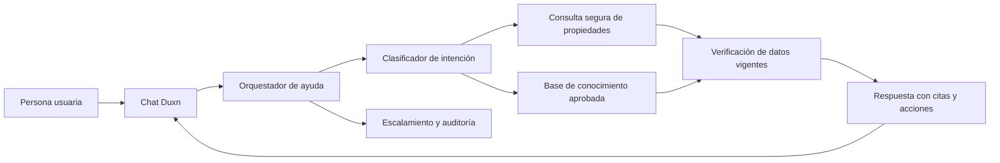

# Especificación funcional — Asistente inmobiliario de Duxn

**Estado:** Propuesta inicial lista para validar e implementar  
**Producto:** Duxn — plataforma inmobiliaria colaborativa  
**Autor:** Manus AI  
**Fecha:** 11 de agosto de 2026

## 1. Propósito

El **Asistente Duxn** será el punto de ayuda conversacional dentro de la plataforma. Su misión es resolver dudas de visitantes, compradores, arrendatarios, propietarios y colaboradores con información verificable de las publicaciones inmobiliarias y de las reglas de operación de Duxn. No será un buscador aislado ni una fuente de respuestas genéricas: cada respuesta sobre una propiedad deberá estar vinculada a datos vigentes de su ficha pública y señalar claramente cuando exista información no disponible, pendiente de confirmación o reservada.

> **Regla central:** el asistente explica datos publicados y procedimientos de Duxn; nunca inventa precio, disponibilidad, características, comisiones, condiciones contractuales o estatus de una propiedad.

La primera versión atenderá tres necesidades principales. La primera consiste en descubrir propiedades de venta o renta mediante preguntas naturales, como “busco departamento de dos recámaras en renta”. La segunda consiste en explicar la ficha de una propiedad concreta, sus características, estatus, requisitos y acciones disponibles. La tercera consiste en orientar a cada persona sobre el proceso de contacto, visita, publicación, colaboración y atribución de una operación.

| Audiencia | Necesidad principal | Resultado esperado del asistente |
|---|---|---|
| Visitante, comprador o arrendatario | Encontrar y entender propiedades, requisitos y siguientes pasos. | Propiedades coincidentes, ficha resumida, disponibilidad visible y acción para contactar o solicitar visita. |
| Propietario o anunciante | Publicar, actualizar y administrar una propiedad. | Explicación del proceso, campos requeridos, estado de revisión y canal de soporte. |
| Colaborador inmobiliario | Compartir una propiedad, conocer reglas de atribución y dar seguimiento permitido. | Explicación de elegibilidad, vínculo atribuible, divulgación comercial y límites de visibilidad. |
| Operaciones y moderación | Corregir, escalar o atender información conflictiva. | Registro de la consulta, propiedad relacionada, motivo de escalamiento y trazabilidad. |

## 2. Alcance de la primera versión

El asistente deberá estar disponible como un botón persistente en las rutas de exploración y detalle de propiedades. Si la conversación comienza desde una ficha, recibirá el identificador de la propiedad como contexto; si comienza desde el catálogo, podrá convertir la intención del usuario en filtros. Cada resultado de propiedad se mostrará como una tarjeta enlazada a su ficha, no como un bloque de texto sin referencia.

| Capacidades incluidas | Comportamiento exigido |
|---|---|
| Búsqueda guiada de propiedades | Extrae operación, ubicación, tipo, rango de precio, recámaras, baños, estacionamientos y amenidades. Si falta un dato que cambie significativamente los resultados, lo pregunta antes de buscar. |
| Resumen de ficha | Devuelve sólo datos públicos vigentes: precio, moneda, tipo de operación, ubicación publicada, superficies, distribución, amenidades, imágenes, estado, disponibilidad y fecha de actualización. |
| Comparación breve | Permite comparar hasta tres propiedades vigentes mediante atributos homogéneos y con enlaces a sus fichas. |
| Orientación de proceso | Explica cómo contactar, agendar visita, guardar, compartir, publicar, reportar una ficha y colaborar en una operación. |
| Condiciones de renta | Identifica requisitos publicados, depósitos, plazos, mascotas, mantenimiento y el requisito de póliza jurídica cuando la publicación lo indique. |
| Ayuda para colaboradores | Explica si una propiedad permite colaboración, la comisión o regla publicada, condiciones de atribución y cómo generar o compartir el enlace autorizado. |
| Escalamiento | Dirige al propietario, profesional asignado o equipo de Duxn cuando la respuesta requiere confirmación humana o manejo de un caso. |

Quedan expresamente fuera de la primera versión la negociación de precios, el compromiso de apartados, la validación legal de documentos, la determinación de elegibilidad crediticia, la creación de contratos, la recepción de pagos y cualquier promesa de cierre, comisión o aprobación. Estas acciones requieren flujos autenticados, autorizados y auditables fuera del chat.

## 3. Datos de propiedad y fuente de verdad

La información de propiedades debe seguir perteneciendo al módulo inmobiliario. El asistente sólo tendrá acceso de lectura a un contrato de consultas y nunca modificará una publicación directamente. Un índice de búsqueda o conocimiento puede acelerar la recuperación de contenido descriptivo, pero la respuesta final siempre deberá contrastarse contra la API de la propiedad antes de presentarla.

| Grupo de datos | Campos mínimos expuestos al asistente | Regla de respuesta |
|---|---|---|
| Identidad y publicación | `property_id`, URL pública, título, tipo de operación, tipo de inmueble, estado de publicación, fecha de actualización. | Sólo propiedades `publicada` y `activa` se recomiendan al público. |
| Precio y disponibilidad | Precio, moneda, periodicidad de renta, mantenimiento, gastos publicados, disponibilidad, vigencia y condiciones de actualización. | Si la fecha de actualización está vencida o el estatus es incierto, se muestra “requiere confirmación”. |
| Ubicación | País, estado, municipio/alcaldía, colonia/zona y geolocalización pública aproximada. | La dirección exacta, claves de acceso y datos privados no se muestran en el chat público. |
| Características | Recámaras, baños, estacionamientos, área construida, terreno, antigüedad, piso, orientación, amenidades y restricciones publicadas. | Cada valor debe proceder de un campo estructurado o de una descripción aprobada. |
| Media | Portada, galería pública, recorrido, plano y documentos permitidos. | No se entregan archivos con información personal o documentación privada. |
| Confianza | Estatus de verificación, advertencias, propiedad reportada y fecha de la revisión. | La verificación se declara sólo si existe una marca vigente; nunca se infiere. |
| Renta y requisitos | Depósito, aval/obligado solidario, póliza jurídica, mascotas, plazo, reglas de visitas y documentos requeridos. | Se diferencia entre “requisito publicado” y “pendiente de confirmar con el anunciante”. |
| Colaboración | Elegibilidad, tipo de colaboración, comisión o incentivo publicado, regla de atribución, vigencia y restricciones. | La explicación debe incluir condiciones y no garantizar cobro o disponibilidad futura. |

Para habilitar respuestas detalladas y trazables, el catálogo inmobiliario deberá exponer como mínimo los siguientes recursos de sólo lectura. Los nombres son contratos de referencia y pueden resolverse con REST, RPC o GraphQL conservando el comportamiento indicado.

| Operación de lectura | Propósito | Respuesta mínima esperada |
|---|---|---|
| `GET /api/properties` | Buscar propiedades públicas con filtros estructurados. | Lista paginada, filtros aplicados, total, tarjetas resumidas y fecha de consulta. |
| `GET /api/properties/:propertyId` | Consultar la ficha pública vigente de una propiedad. | Datos estructurados, condiciones vigentes, verificación, disponibilidad y URL canónica. |
| `GET /api/properties/:propertyId/faq` | Recuperar respuestas aprobadas de la propiedad. | Pregunta, respuesta, versión, fuente y fecha de revisión. |
| `GET /api/properties/:propertyId/collaboration` | Consultar reglas visibles de colaboración. | Elegibilidad, reglas, incentivo publicado, divulgaciones y vigencia. |
| `GET /api/help/articles` | Consultar políticas, guías y preguntas frecuentes de Duxn. | Artículo, versión, público objetivo, vigencia y URL. |

La sincronización deberá ser impulsada por eventos de dominio. Cuando una propiedad cambie, se actualizará el índice de recuperación; cuando una respuesta se genere, el servicio consultará nuevamente la ficha vigente para atributos decisivos como precio, disponibilidad, estatus, verificación y condiciones de colaboración.

| Evento | Consecuencia para el asistente |
|---|---|
| `property.published` | Hace recuperable la propiedad y genera su ficha de conocimiento público. |
| `property.updated` | Invalida datos en caché e indexa la versión aprobada más reciente. |
| `property.availability_changed` | Actualiza inmediatamente el estatus de recomendación y las acciones disponibles. |
| `property.paused` o `property.unpublished` | Impide recomendaciones nuevas y reemplaza respuestas por una explicación de indisponibilidad. |
| `property.verification_changed` | Refresca la marca de verificación; no conserva etiquetas previas. |
| `property.collaboration_terms_updated` | Versiona las condiciones de colaboración para evitar explicar reglas caducas. |
| `help_article.updated` | Reindexa la política o guía con fecha de vigencia y responsable de aprobación. |

## 4. Arquitectura de respuesta verificable

La capa conversacional se organizará como un orquestador del servidor. Identificará la intención de la persona, llamará a las fuentes de verdad autorizadas y redactará una respuesta fundamentada en los resultados. El modelo de lenguaje puede mejorar la comprensión y redacción, pero no tendrá acceso directo a la base de datos ni permiso para ejecutar acciones sensibles.

La respuesta deberá conservar un objeto de evidencia interno por cada afirmación material. Para una propiedad concreta, ese objeto incluye `property_id`, versión o fecha de actualización, campos consultados y URL pública. Para una política, incluye artículo, versión, vigencia y responsable. El interfaz mostrará una fuente legible como “Datos de la ficha actualizados el 10 de agosto de 2026” y el enlace a la propiedad o al artículo aplicable.

| Etapa | Regla de implementación |
|---|---|
| Comprensión | Convierte el mensaje en una intención y filtros; los filtros ambiguos se devuelven como pregunta de aclaración. |
| Recuperación | Consulta la API de propiedades y artículos aprobados; el texto no estructurado sirve para contexto, no para sobrescribir campos vigentes. |
| Verificación | Antes de mencionar precio, disponibilidad, verificación o comisión, realiza una lectura fresca de la fuente de verdad. |
| Redacción | Explica en lenguaje simple, distingue hechos de sugerencias y adjunta tarjetas o enlaces. |
| Acción | Ofrece una acción autorizada: abrir ficha, guardar, contactar, solicitar visita, compartir o hablar con una persona. |
| Registro | Guarda intención, fuentes, versión de respuesta, resultado y motivo de escalamiento sin almacenar más datos personales de los necesarios. |

## 5. Comportamiento conversacional

El asistente empezará con mensajes claros y utilizará preguntas cortas. Ante resultados de búsqueda, ofrecerá un máximo de tres opciones iniciales y explicará los filtros aplicados. La prioridad de visualización seguirá la coincidencia con la búsqueda, dando preferencia posterior a propiedades premium o con plan de pago vigente y señalando siempre aquellas verificadas. La condición premium no permitirá ocultar el estatus de verificación, disponibilidad o incompatibilidad con los criterios del usuario.

| Intención | Ejemplo de pregunta | Respuesta esperada |
|---|---|---|
| Buscar | “Quiero rentar una casa de tres recámaras en Mérida.” | Confirma presupuesto o zona si hace falta, devuelve tarjetas coincidentes y explica los filtros. |
| Detalle | “¿Tiene estacionamiento la propiedad DUX-1042?” | Lee la ficha vigente y responde el atributo, indicando si hay información no publicada. |
| Precio | “¿Cuánto cuesta y qué incluye la renta?” | Muestra precio, moneda, periodicidad, mantenimiento y gastos publicados; no supone cargos no descritos. |
| Disponibilidad | “¿Aún está disponible?” | Consulta el estatus en tiempo real; si no está confirmado, solicita contacto en lugar de afirmar disponibilidad. |
| Requisitos de renta | “¿Necesito póliza jurídica?” | Indica el requisito publicado y explica que Duxn puede facilitar la opción, pero la póliza se contrata entre arrendador y arrendatario con un proveedor externo. |
| Confianza | “¿La propiedad está verificada?” | Declara el estado sólo cuando existe una verificación vigente y enlaza a la explicación de su alcance. |
| Colaboración | “¿Puedo promover esta propiedad?” | Consulta elegibilidad y reglas; ofrece el enlace autorizado sólo para usuarios con permiso. |
| Ayuda general | “¿Cómo publico mi departamento?” | Resume el flujo de publicación, revisión, verificación y actualización de disponibilidad. |

Las respuestas que afecten una decisión relevante deberán incluir un aviso contextual. Por ejemplo, al explicar requisitos de renta: “Los requisitos mostrados son los publicados por el anunciante; confirma con la parte responsable antes de firmar.” Al explicar colaboración: “La comisión depende de las condiciones vigentes, de la atribución registrada y de la operación confirmada.” Estos mensajes previenen que una explicación automática se interprete como garantía o asesoría profesional.

## 6. Póliza jurídica en arrendamientos

Duxn no deberá presentarse como proveedor ni asesor jurídico. Cuando una publicación tenga activo el campo `requires_legal_policy`, el asistente informará de manera transparente que la propiedad requiere una póliza jurídica. El sistema podrá habilitar una opción de interés para que las partes conozcan proveedores externos, pero debe expresar que la contratación, evaluación y documentación pertenecen al arrendador y al arrendatario.

| Situación | Respuesta obligatoria del asistente |
|---|---|
| Propiedad con póliza requerida | “Esta propiedad publicada requiere póliza jurídica. El requisito y sus condiciones deben confirmarse con el anunciante antes de avanzar.” |
| Pregunta por costo o aprobación | “Duxn no determina la aprobación, cobertura ni condiciones de la póliza. La información final la proporciona el proveedor externo y las partes contratantes.” |
| Propiedad sin requisito publicado | “La ficha no indica que sea obligatoria una póliza jurídica. Confirma los requisitos definitivos con el anunciante antes de formalizar.” |
| Solicitud de asesoría legal | “Puedo explicar el flujo de Duxn y los requisitos publicados, pero no proporcionar asesoría legal. Para una consulta jurídica, corresponde acudir a un profesional o proveedor autorizado.” |

## 7. Límites, privacidad y escalamiento

El asistente debe proteger la información personal, respetar permisos y detectar situaciones que requieren intervención humana. No revela teléfono, correo, domicilio exacto, documentos, identidad, negociación interna, historial de mensajes, datos financieros o información de un usuario si estos datos no son públicos o no están autorizados para la persona que pregunta.

| Caso | Acción del asistente |
|---|---|
| Información no publicada o incierta | Declara que no está disponible en la ficha y ofrece contacto o solicitud de visita. |
| Propiedad despublicada, pausada o vencida | No la recomienda; comunica que no está disponible y propone alternativas coincidentes. |
| Solicitud de negociación, apartado o pago | Conduce al flujo autenticado o a la persona responsable; no promete precio ni reserva. |
| Posible fraude, anuncio duplicado o información errónea | Ofrece el reporte de publicación y crea un caso para moderación con la evidencia de la consulta. |
| Lenguaje ofensivo, amenaza o discriminación | Aplica moderación, limita la interacción y conserva el registro conforme a política. |
| Asesoría jurídica, fiscal, crediticia o de inversión | Explica los datos publicados y remite a un profesional calificado para orientación personalizada. |
| Error de integración o falta de fuente | Indica la limitación sin fabricar una respuesta y ofrece reintento o atención humana. |

## 8. Opciones de lanzamiento

Existen dos formas viables de iniciar. Ambas necesitan las mismas fuentes de datos y controles; la diferencia principal es la naturalidad de la conversación y el esfuerzo de implementación.

| Enfoque | Alcance | Ventajas y límites | Costo operativo | Complejidad de configuración |
|---|---|---|---|---|
| **Ayuda guiada con búsqueda y respuestas aprobadas** | Filtros de propiedades, tarjetas, preguntas frecuentes y flujos predefinidos. | Máximo control, respuestas deterministas y menor riesgo; entiende menos variaciones de lenguaje natural. | Bajo, sin generación de respuesta abierta. | Baja a media. |
| **Asistente conversacional fundamentado en datos vivos** | Comprende preguntas abiertas, consulta propiedades y políticas, y redacta respuestas con evidencia. | Mejor experiencia de conversación y cobertura; requiere control de fuentes, evaluación de calidad y consumo por interacción. | Variable según uso y modelo elegido. | Media. |

El primer enfoque permite validar las necesidades reales con bajo riesgo. El segundo es el objetivo recomendado por la solicitud de un chatbot automático, siempre que las propiedades estén disponibles mediante una API fiable y se implementen las reglas de evidencia de esta especificación. La decisión debe considerar si Duxn ya cuenta con un catálogo estructurado y qué volumen de conversaciones se espera.

## 9. Criterios de aceptación del MVP

| Área | Criterio verificable |
|---|---|
| Exactitud | El asistente no responde con un precio, disponibilidad, estatus de verificación o regla de colaboración que no provenga de la lectura vigente de una propiedad. |
| Transparencia | Toda respuesta sobre una ficha muestra enlace a la propiedad y fecha de actualización o indica que requiere confirmación. |
| Relevancia | Una búsqueda por operación, zona y características devuelve resultados ordenados por coincidencia; la preferencia premium sólo se aplica entre resultados adecuados. |
| Privacidad | Las sesiones públicas no exponen dirección exacta, teléfonos, correos, documentos ni datos de otras personas. |
| Renta | Las propiedades con requisito de póliza jurídica lo comunican inequívocamente y sin presentar a Duxn como proveedor jurídico. |
| Colaboración | Los enlaces y condiciones de colaboración se ofrecen sólo a personas autenticadas y elegibles. |
| Escalamiento | Las dudas no respondibles, conflictos, reportes y operaciones sensibles se dirigen a un canal humano con la propiedad y el motivo asociados. |
| Observabilidad | Cada respuesta conserva la intención, fuentes consultadas, versión de datos y resultado de la interacción para auditoría y mejora. |

## 10. Decisiones necesarias antes de construir

La plataforma actual contiene documentación de módulos, pero todavía no incluye una aplicación ni un catálogo de propiedades implementado. Por ello, antes de desarrollar el asistente es necesario confirmar los siguientes puntos arquitectónicos.

| Decisión | Opciones a confirmar | Impacto directo |
|---|---|---|
| Fuente de propiedades | Base de datos propia, CRM inmobiliario, API externa o importación inicial. | Define el conector de datos, frecuencia de sincronización y fuente de verdad. |
| Alcance geográfico | País o ciudades iniciales. | Determina moneda, formatos de ubicación, políticas y textos requeridos. |
| Canales de ayuda | Sólo chat dentro de la plataforma, también WhatsApp, o ambos. | Define autenticación, privacidad, capacidad de acciones y trazabilidad. |
| Modelo de colaboración | Comisión fija, por porcentaje, por acuerdo de propiedad o sin incentivos en el MVP. | Define qué reglas puede explicar el asistente y qué acciones autorizadas existen. |
| Atención humana | Propietario, asesor asignado, equipo de Duxn o modelo mixto. | Define el mecanismo de escalamiento y los tiempos esperados de respuesta. |

## Referencias internas

[1]: arquitectura-herramientas-nativas-yellow-duxn.md "Arquitectura funcional de Yellow Duxn"

[2]: diseno-modulos-y-flujos-yellow-duxn.md "Diseño de módulos y flujos de Yellow Duxn"

[3]: especificacion-integracion-mvp-yellow-duxn.md "Especificación de integración MVP de Yellow Duxn"

La propuesta reutiliza los principios existentes de modularidad, permisos, eventos, trazabilidad y condiciones versionadas, adaptándolos al dominio inmobiliario de Duxn.
