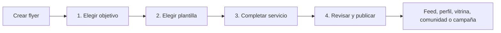
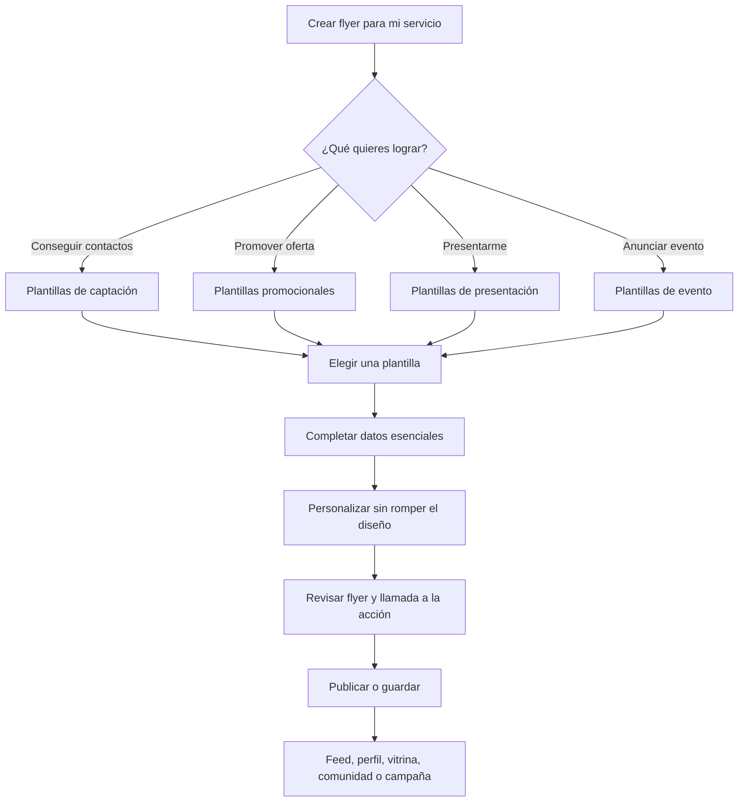
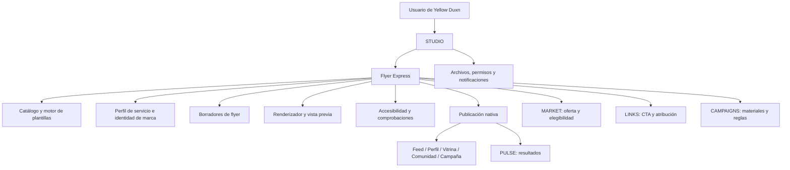

# Flyer Express — Herramienta nativa prioritaria de Yellow Duxn

**Módulo anfitrión:** STUDIO  
**Prioridad:** Máxima para el MVP de creación de contenido  
**Propósito:** Permitir que una persona promocione un servicio con un flyer atractivo y listo para compartir en pocos clics, sin saber diseñar y sin instalar ninguna aplicación adicional.

> **Decisión de producto:** Flyer Express pasa a ser la primera acción recomendada de STUDIO. El editor de contenido general sigue disponible, pero la experiencia de flyer guiado es el camino principal para emprendedores, profesionales y promotores de servicios.

## 1. Problema prioritario

Muchas personas que prestan servicios —por ejemplo, belleza, reparaciones, clases, asesorías, salud y bienestar, gastronomía, transporte, eventos o servicios profesionales— necesitan anunciarse con frecuencia, pero no dominan composición, tipografía, color ni herramientas de diseño. Cuando el proceso comienza con un lienzo vacío, se bloquean, invierten demasiado tiempo o terminan publicando piezas poco claras.

Flyer Express elimina ese bloqueo con un flujo asistido que parte de una plantilla adecuada, solicita únicamente la información esencial del servicio y compone una pieza coherente de forma automática. La herramienta no busca reemplazar un editor profesional completo: busca producir una comunicación comercial clara, publicable y adaptable a la red social de Yellow Duxn.

| Necesidad de la persona usuaria | Respuesta nativa de Flyer Express |
|---|---|
| “No sé diseñar.” | Plantillas por objetivo y servicio, con composición y jerarquía ya resueltas. |
| “Necesito publicarlo rápido.” | Recorrido guiado de pocos pasos y valores precargados desde el perfil. |
| “No sé qué escribir.” | Campos con ejemplos y sugerencias de texto comercial breve, siempre editables. |
| “Quiero que me contacten.” | Llamada a la acción, botón de contacto, enlace, código QR o reserva según la capacidad habilitada. |
| “Mi negocio debe verse confiable.” | Tipografías legibles, contraste, espacios y estilos bloqueados en cada plantilla. |
| “Quiero compartirlo donde ya está mi audiencia.” | Publicación directa en Yellow Duxn, vitrina, comunidad o campaña; descarga solo como opción adicional. |

## 2. Usuarios y casos de uso prioritarios

La herramienta está diseñada primero para la persona que promueve **su propio servicio**, no para alguien con experiencia en herramientas gráficas. También puede ser utilizada por afiliados autorizados y marcas, pero esos flujos no definen la complejidad inicial del producto.

| Persona | Meta inmediata | Información disponible | Resultado de valor |
|---|---|---|---|
| **Prestador de servicio independiente** | Conseguir contactos o reservas. | Nombre, servicio, zona, teléfono/mensajería, foto propia y precio opcional. | Flyer claro con llamada a la acción y publicación nativa. |
| **Emprendedor local** | Promover una oferta temporal. | Servicio, descuento, periodo, imagen y datos de contacto. | Pieza promocional con vigencia visible y sin promesas ambiguas. |
| **Profesional que inicia** | Presentarse y explicar qué hace. | Nombre, especialidad, breve descripción, foto y modalidad de atención. | Flyer de presentación confiable y fácil de entender. |
| **Afiliado autorizado** | Recomendar un servicio de una oferta activa. | Oferta, condiciones, enlace atribuido y recursos aprobados. | Flyer comercial con divulgación y CTA válidos. |
| **Marca o gestor** | Entregar una base editable de campaña. | Identidad visual, mensajes, campañas y materiales aprobados. | Plantilla bloqueada en lo esencial y adaptable por participantes. |

## 3. Alcance MVP: una promesa sencilla

El usuario debe poder generar un primer flyer publicable en **cuatro decisiones principales**: elegir objetivo, elegir plantilla, completar datos y publicar/compartir. Las opciones avanzadas están disponibles después de que exista una pieza correcta, no antes.



| Paso | Pregunta que responde | Decisión del usuario | Automatización de Flyer Express |
|---:|---|---|---|
| 1 | “¿Para qué lo necesito?” | Promocionar servicio, oferta, presentación, evento o contratación. | Filtra formatos, mensajes y plantillas adecuadas. |
| 2 | “¿Qué estilo me gusta?” | Elige una plantilla de una selección pequeña y explicada. | Aplica composición, paleta y jerarquía predefinidas. |
| 3 | “¿Qué debe decir?” | Completa nombre, servicio, beneficio, contacto y foto opcional. | Precarga perfil, ajusta texto, recorta imagen y valida claridad. |
| 4 | “¿Dónde lo publico?” | Elige audiencia, canal y fecha. | Añade CTA, divulgación comercial cuando aplique y genera la publicación. |

## 4. Límites intencionales del MVP

El MVP debe favorecer resultados consistentes antes que un lienzo infinito de opciones. Una persona sin formación visual no debe tener que aprender capas, reglas de alineación, combinaciones de color o controles de exportación para producir una pieza útil.

| Incluido en MVP | Se pospone para una versión posterior |
|---|---|
| Plantillas verticales y cuadradas para publicaciones sociales. | Lienzo libre de diseño con capas ilimitadas. |
| Edición de texto esencial, foto, colores de marca simples y CTA. | Edición tipográfica avanzada, curvas, máscaras y efectos complejos. |
| Recorte asistido de una foto y biblioteca de recursos aprobados. | Manipulación fotográfica profesional. |
| Publicación directa en Yellow Duxn y uso en vitrinas/campañas. | Integraciones de publicación automática en redes externas. |
| Descarga de una imagen terminada cuando esté habilitada. | Exportaciones de impresión profesional y formatos editables externos. |
| Sugerencias de texto editables y avisos de claridad. | Publicación automática sin confirmación del usuario. |

## 5. Principios de producto para esta herramienta

| Principio | Decisión UX/UI |
|---|---|
| **Primero el objetivo, después el diseño** | La persona comienza por “Conseguir contactos”, “Promover oferta” o “Presentar mi servicio”, no por una cuadrícula de estilos sin contexto. |
| **Pocas opciones, buenas opciones** | Cada categoría muestra una selección curada; “ver más” aparece solo cuando el usuario la solicita. |
| **El perfil ahorra trabajo** | Nombre del negocio, logo, foto, contacto, zona y colores se pueden precargar y editar antes de publicar. |
| **El contenido manda** | La plantilla protege jerarquía, contraste y espacios; el usuario cambia la información, no rompe la composición accidentalmente. |
| **Toda automatización es reversible** | Sugerencias de texto, recortes y combinación de colores se aceptan, editan o descartan de forma explícita. |
| **Publicar es parte del diseño** | El último paso crea una publicación nativa completa, no deja al usuario con una imagen aislada sin audiencia ni CTA. |
| **Transparencia comercial** | Si el flyer promociona una oferta afiliada, el CTA, enlace y divulgación se insertan conforme a sus condiciones. |

## 6. Requisitos de éxito para priorización

| Requisito | Definición operativa |
|---|---|
| **Comprensible para principiantes** | La primera pantalla describe la tarea y cada paso usa lenguaje común, no términos de diseño gráfico. |
| **Rápido sin ocultar decisiones** | El usuario puede terminar con datos mínimos, pero siempre revisa el resultado antes de hacerlo público. |
| **Útil para servicios reales** | Las plantillas contemplan servicio, beneficio, zona/modalidad, contacto, precio o promoción opcional y CTA. |
| **Coherente con Yellow Duxn** | El flyer puede vivir en una publicación, perfil, vitrina, comunidad o campaña desde la misma sesión. |
| **Seguro y confiable** | Las condiciones de ofertas afiliadas, restricciones de campaña y divulgaciones se verifican antes de publicar. |
| **Preparado para personalizar** | La cuenta puede guardar identidad de marca y reutilizar flyers como base, sin depender de un software externo. |

---

**Continuación del diseño:** Las secciones siguientes describen el flujo de pantallas, el personalizador guiado, los componentes, estados y la arquitectura de plantillas de Flyer Express.

## 7. Experiencia principal: de idea a flyer en pocos clics

Flyer Express se presenta dentro de STUDIO con el CTA prioritario **“Crear flyer para mi servicio”**. El recorrido está construido como un asistente breve: cada pantalla pide una decisión que una persona usuaria entiende por sí misma y cada respuesta modifica una vista previa en tiempo real. No existe una pantalla inicial vacía ni un panel técnico de capas.



### 7.1 Paso 0 — Inicio y atajo de creación

La entrada se encuentra como la primera tarjeta de STUDIO y como acción contextual en el perfil del prestador de servicios. Si la cuenta ya completó datos de negocio, la tarjeta muestra una miniatura de su última identidad visual y el texto “Crear un flyer nuevo”. Si no existen datos, la entrada sigue funcionando y pide solo la información necesaria durante el flujo.

| Elemento | Copy sugerido | Comportamiento |
|---|---|---|
| Tarjeta principal | **Crear flyer para mi servicio** — “Elige una plantilla y personalízala en minutos.” | Abre el asistente en el paso 1. |
| Acción secundaria | “Usar un flyer anterior”. | Abre biblioteca filtrada por piezas terminadas y permite duplicar. |
| Acceso de campaña | “Crear desde material de campaña”. | Solo aparece con campañas activas y abre una plantilla autorizada. |
| Acceso de oferta | “Promocionar esta oferta”. | Recibe oferta y divulgación como contexto precargado. |
| Ayuda discreta | “No necesitas experiencia en diseño.” | Abre una explicación breve; no interrumpe el recorrido. |

### 7.2 Paso 1 — Elegir el objetivo del flyer

La primera pregunta debe orientarse a la intención comercial, no a la estética. Conocer el objetivo permite limitar las plantillas a opciones útiles y proponer campos adecuados sin exigir que la persona conozca términos de marketing.

| Objetivo | Descripción de tarjeta | Plantillas y campos sugeridos |
|---|---|---|
| **Conseguir contactos** | “Explica tu servicio y facilita que las personas te escriban.” | Servicio, beneficio, zona/modalidad, contacto y CTA “Escríbeme”. |
| **Promover una oferta** | “Destaca una promoción, precio especial o cupo limitado.” | Oferta, vigencia, precio/beneficio opcional, condiciones y CTA. |
| **Presentar mi servicio** | “Dile a tu comunidad quién eres y cómo ayudas.” | Nombre, especialidad, foto, descripción y forma de contacto. |
| **Anunciar un evento** | “Invita a una fecha, clase, sesión o actividad.” | Título, fecha, hora, lugar/modalidad, cupos y CTA de registro. |
| **Buscar contrataciones** | “Muestra el servicio que ofreces a empresas o personas.” | Competencia, prueba social opcional, disponibilidad y contacto. |

Cada tarjeta incluye una miniatura representativa, una frase en lenguaje común y ejemplos de uso. Las tarjetas no prometen resultados económicos; describen la acción que permiten solicitar, como “recibir mensajes” o “mostrar una promoción”.

### 7.3 Paso 2 — Elegir una plantilla sin abrumar

Después de seleccionar el objetivo, Flyer Express muestra una selección inicial de seis plantillas. Cada una tiene composición, contraste y jerarquía resueltos. La persona puede elegir según una descripción simple —por ejemplo, “foto protagonista”, “información clara”, “estilo elegante” o “alto impacto”— sin comparar docenas de variantes al mismo tiempo.

| Área de la pantalla | Diseño UX/UI | Regla de interacción |
|---|---|---|
| Cabecera | “Elige un estilo para tu [objetivo]” y progreso `Paso 2 de 4`. | La barra de progreso es textual y visual. |
| Recomendación | Primera tarjeta marcada “Recomendada para tu servicio”. | La recomendación explica por qué: “Da prioridad a tu foto y contacto”. |
| Cuadrícula inicial | Seis tarjetas de plantilla, desplazables y con nombres descriptivos. | Pulsar una tarjeta actualiza la previsualización; no confirma todavía. |
| Filtros simples | Con foto, sin foto, elegante, enérgico, minimalista, local. | Los filtros se pueden eliminar de uno en uno. |
| “Ver más estilos” | Acceso secundario a biblioteca completa por objetivo. | No aparece como requisito para avanzar. |
| Panel de previsualización | Flyer con texto de ejemplo y proporción real. | “Usar esta plantilla” confirma y crea la pieza editable. |

Las tarjetas deben mostrar variaciones reales de composición, no solo cambiar el color. La biblioteca inicial del MVP prioriza legibilidad en pantalla móvil y formatos cuadrados y verticales; las versiones horizontales quedan fuera hasta validar el uso.

### 7.4 Paso 3 — Completar datos esenciales

Una vez elegida la plantilla, Flyer Express abre un formulario conversacional junto a una vista previa que cambia al instante. En lugar de presentar controles de tamaño, posición y tipografía, hace preguntas que cualquier prestador de servicios puede responder.

| Campo conversacional | Ejemplo de ayuda | Fuente por defecto | Regla de composición automática |
|---|---|---|---|
| **Nombre de tu servicio** | “Ej.: Reparación de celulares a domicilio”. | Perfil de negocio si existe. | Se ajusta a la zona de título con reducción limitada y aviso si es demasiado largo. |
| **¿Cómo ayudas?** | “Ej.: Diagnóstico rápido y garantía de 30 días”. | Descripción corta del perfil. | Se convierte en subtítulo de máximo dos líneas. |
| **Promoción o beneficio** | “Ej.: 15% de descuento esta semana”. | Oferta/campaña si aplica. | Se muestra como distintivo solo cuando la plantilla lo admite. |
| **Zona o modalidad** | “Ej.: Atención en Medellín o por videollamada”. | Perfil y preferencias. | Se incorpora en el bloque de detalles. |
| **Forma de contacto** | “Escríbeme por mensaje” o dato autorizado. | Método de contacto seleccionado en perfil. | Construye CTA y botón/link nativo correspondientes. |
| **Foto o logo** | “Sube una foto tuya, de tu trabajo o un logo”. | Activos de perfil. | Recorta según zona segura y permite cambiar el encuadre simple. |

El formulario marca como obligatorios solo los campos que la plantilla necesita para ser comprensible: servicio, una forma de contacto y una llamada a la acción. Precio, descuento, foto, ubicación y prueba social son opcionales. Cuando el usuario deja un campo vacío, la plantilla se reequilibra en vez de dejar un bloque vacío.

### 7.5 Sugerencias de texto sin sustituir a la persona

Para quien no sabe cómo redactar, Flyer Express puede ofrecer propuestas cortas basadas exclusivamente en los datos que la persona escribió. Estas sugerencias nunca se publican solas y siempre se pueden editar, reemplazar o ignorar.

| Momento | Sugerencia | Acciones visibles |
|---|---|---|
| Campo de beneficio vacío | “¿Quieres una idea para explicar tu servicio?” | “Ver sugerencia” o “Escribir la mía”. |
| Texto demasiado largo | “Este mensaje puede ser más fácil de leer en dos líneas.” | “Acortar propuesta”, “Conservar mi texto”. |
| CTA ausente | “Ayuda a las personas a saber qué hacer después.” | “Escríbeme”, “Reserva ahora”, “Pide información”, “Ver detalles”. |
| Presentación sin diferenciador | “Puedes añadir una razón para elegirte.” | “Añadir beneficio” o “Continuar sin él”. |

Las sugerencias no deben inventar acreditaciones, precios, disponibilidad, resultados, testimonios ni garantías. Si la persona promociona una oferta afiliada, la propuesta de copy respeta las condiciones aprobadas por MARKET y no modifica la divulgación requerida.

### 7.6 Paso 4 — Personalizar sin romper el diseño

Después de completar lo esencial, la persona llega a un modo de ajuste simple. El objetivo no es transformarla en diseñadora; es darle suficientes opciones para que el flyer se sienta propio y coherente con su servicio.

| Control visible | Opciones permitidas | Protección incorporada |
|---|---|---|
| **Estilo** | 3–5 variantes de paleta compatibles con la plantilla. | No permite combinaciones que reduzcan legibilidad de texto esencial. |
| **Foto** | Cambiar, recortar, ajustar foco o eliminar si la plantilla admite variante sin foto. | Marca zona segura y no permite perder el CTA fuera del marco. |
| **Mensaje destacado** | Alternar entre beneficio, promoción o frase de presentación. | Limita longitud y reequilibra bloques automáticamente. |
| **Icono de contacto** | Mensaje, teléfono, reserva o enlace autorizado. | Solo muestra canales validados por el perfil/campaña. |
| **Estilo de marca** | Aplicar logo y colores guardados de negocio. | Mantiene contraste y reserva espacio para logo pequeño. |
| **Diseño** | “Cambiar plantilla” y “Probar otra versión”. | Conserva todos los datos ya capturados al cambiar. |

La edición se realiza con controles de alto nivel: elegir, cambiar, quitar, mover foco y deshacer. Los elementos no se arrastran libremente en el MVP. Si se implementa ajuste de orden, solo se ofrecen composiciones prediseñadas como “foto arriba”, “foto a la derecha” o “sin foto”, evitando desalineaciones.

### 7.7 Paso 5 — Revisar, publicar y reutilizar

Antes de hacer público el flyer, la persona ve la pieza en formato real y una lista breve de comprobaciones. La decisión final presenta claramente dónde se publicará y qué contacto podrán usar las personas que lo vean.

| Bloque de revisión | Pregunta que responde | Comportamiento |
|---|---|---|
| Vista previa | “¿Así se verá en Yellow Duxn?” | Permite alternar formato cuadrado/vertical cuando la plantilla lo soporte. |
| Claridad | “¿Se entiende qué ofreces y cómo contactarte?” | Marca servicio, CTA y contacto; cualquier ausencia lleva al campo. |
| Accesibilidad | “¿La imagen tiene descripción?” | Solicita texto alternativo final, generado como punto de partida si hay datos suficientes y editable. |
| Transparencia | “¿Es una promoción afiliada o de campaña?” | Añade divulgación y enlace validados solo cuando corresponde. |
| Destino | “¿Dónde quieres compartirlo?” | Feed, perfil de servicio, vitrina, comunidad, campaña o guardar como borrador. |
| Publicación | “¿Ahora o más tarde?” | Publicar, programar o guardar. Si requiere revisión, el CTA cambia explícitamente. |

Al completar la publicación, Flyer Express ofrece “Ver mi flyer”, “Compartir dentro de Yellow Duxn”, “Crear otra versión” y “Ver resultados”. La descarga de imagen puede aparecer como una acción secundaria cuando se habilite; no es necesaria para cumplir el objetivo principal de promocionar dentro del ecosistema.

## 8. Decisiones de estado y recuperación

| Situación | Experiencia que debe recibir el usuario |
|---|---|
| Aún no tiene perfil de negocio | Solo se solicitan nombre de servicio y contacto en el flujo; al terminar, se invita a guardar esos datos para próximos flyers. |
| Abandona a mitad de creación | Se guarda automáticamente como “Flyer sin terminar” con miniatura y último paso alcanzado. |
| Cambia de plantilla | El sistema conserva texto, contacto, foto y objetivo; informa si un campo no cabe en la nueva composición. |
| Foto de baja calidad | Aviso amable: “Esta foto puede verse borrosa. Puedes usarla o elegir otra.” No bloquea sin razón. |
| Texto excede el espacio | Propone abreviar o escoger una plantilla de información amplia; nunca reduce el texto hasta hacerlo ilegible. |
| Falta forma de contacto | Impide publicación del flyer de captación y explica por qué con CTA para elegir un método. |
| Oferta afiliada no elegible | Guarda el flyer, bloquea CTA comercial y dirige a solicitud/alternativa, igual que el flujo STUDIO. |
| Sin conexión | Muestra cambios guardados en el dispositivo, permite continuar editando y bloquea publicación hasta sincronizar. |

## 9. Arquitectura de navegación dentro de STUDIO

| Ruta propuesta | Vista | Propósito |
|---|---|---|
| `/crear/flyer` | Inicio de Flyer Express | Elegir objetivo y reanudar flyers. |
| `/crear/flyer/plantillas` | Biblioteca contextual | Escoger una plantilla por objetivo. |
| `/crear/flyer/:flyerId/datos` | Datos esenciales | Completar información y ver vista previa viva. |
| `/crear/flyer/:flyerId/personalizar` | Ajuste simplificado | Personalizar estilo, foto, CTA y marca. |
| `/crear/flyer/:flyerId/revisar` | Revisión/publicación | Validar, elegir destino y publicar. |
| `/crear/flyer/biblioteca` | Flyers guardados | Reanudar, duplicar, archivar y ver resultados. |

Flyer Express se puede implementar como un modo especializado de STUDIO. Comparte borradores, medios, accesibilidad, audiencia, moderación y publicación; agrega su propio modelo de plantilla y controles guiados. Por ello, la persona no percibe una herramienta externa, pero el equipo mantiene una frontera técnica clara para evolucionarla de forma independiente.

## 10. Inventario de pantallas y especificación UX/UI

### F-01 — Inicio de Flyer Express

La pantalla inicial muestra la tarea principal antes que cualquier catálogo. El usuario debe entender que puede obtener una pieza completa aunque aún no tenga logo, foto o identidad de marca.

| Región | Contenido | Interacción y comportamiento |
|---|---|---|
| Cabecera | Regreso a STUDIO, título “Crear flyer”, acceso a “Mis flyers”. | Mantiene el contexto de origen: perfil, oferta o campaña. |
| Bloque principal | Título “Crea un flyer para promocionar tu servicio” y subtítulo “Elige una plantilla y complétala en pocos pasos”. | Botón primario **“Empezar mi flyer”**. |
| Accesos rápidos | “Duplicar un flyer”, “Promocionar una oferta” y “Usar material de campaña”. | Solo aparecen si existe contenido o contexto aplicable. |
| Reanudar | Hasta tres tarjetas de flyers sin terminar con miniatura, objetivo y último cambio. | Abrir, duplicar o archivar desde menú secundario. |
| Ayuda | Enlace “¿Cómo funciona?” con explicación de cuatro pasos. | Se abre en hoja corta; no fuerza tutorial. |

**Estado de primera vez:** Se reemplazan las tarjetas de reanudar por una sola explicación visual de los cuatro pasos y el botón “Empezar mi flyer”. No se solicita configurar una marca antes de permitir crear la primera pieza.

### F-02 — Objetivo del flyer

Esta pantalla expresa el objetivo en lenguaje de negocio cotidiano. La decisión alimenta la biblioteca de plantillas y el formulario de contenido siguiente.

| Componente | Anatomía | Estado e interacción |
|---|---|---|
| Progreso | `Paso 1 de 4 · Objetivo`. | Se anuncia de forma accesible y no oculta el regreso. |
| Tarjeta de objetivo | Icono, título, descripción, miniatura y ejemplo de CTA. | La selección se confirma con un contorno, texto “Seleccionado” y botón “Continuar”. |
| Ayuda contextual | “Puedes cambiar esta decisión más adelante.” | Al cambiar objetivo, se conservan campos compatibles. |
| Acción de origen comercial | “Elegir una oferta” cuando entra como afiliado. | Abre MARKET integrado y al volver conserva el punto del flujo. |

El diseño inicial debe mostrar cinco objetivos como máximo, en una cuadrícula de una columna en móvil y hasta tres columnas en escritorio. No se debe obligar a desplazarse para encontrar el botón “Continuar”.

### F-03 — Biblioteca de plantillas

Esta es una superficie de descubrimiento, no un editor. Las plantillas se presentan como soluciones que priorizan distintos tipos de contenido; cada una debe tener un nombre descriptivo que evita terminología estética innecesaria.

| Región | Elementos | Interacción |
|---|---|---|
| Cabecera | Regreso, título dinámico y progreso `Paso 2 de 4 · Estilo`. | Si el usuario retrocede, conserva objetivo. |
| Filtros simples | Con foto, sin foto, elegante, directo, colorido, minimalista. | La primera opción recomienda una plantilla sin impedir explorar. |
| Tarjeta de plantilla | Miniatura a proporción real, nombre, descripción, etiquetas de contenido y “Vista previa”. | Tocar abre la previsualización ampliada, no crea todavía el flyer. |
| Panel de previsualización | Vista móvil real, explicación de qué destaca y botón “Usar esta plantilla”. | Confirmar crea el `flyer_draft` y abre F-04. |
| Acceso a biblioteca amplia | “Ver más estilos”. | Muestra más plantillas del mismo objetivo, con la misma jerarquía. |

| Nombre de plantilla de ejemplo | Cuándo sugerirla | Estructura protegida |
|---|---|---|
| **Servicio claro** | Reparaciones, clases, asesorías y servicios profesionales. | Título, beneficio, detalles y CTA; admite foto secundaria. |
| **Foto que convence** | Belleza, gastronomía, eventos y oficios visuales. | Foto protagonista, título breve, distintivo y contacto. |
| **Promoción directa** | Ofertas de periodo limitado y cupos. | Beneficio/promoción, vigencia, condiciones breves y CTA. |
| **Tu presentación** | Profesionales que se dan a conocer. | Nombre, especialidad, retrato/logo, propuesta y contacto. |
| **Agenda abierta** | Reservas, citas, cursos, talleres y eventos. | Fecha/horario, capacidad, ubicación/modalidad y registro. |
| **Sin foto, con impacto** | Negocios nuevos sin material visual propio. | Mensaje destacado, icono aprobado, información y CTA. |

### F-04 — Completar mi flyer

F-04 es la pantalla central. En escritorio usa un formulario izquierdo y previsualización derecha; en móvil alterna entre “Editar” y “Ver flyer” sin perder contexto. La edición modifica datos semánticos, nunca posiciones pixel por pixel.

| Área | Elementos visibles | Reglas UX/UI |
|---|---|---|
| Barra superior | Volver, nombre automático de borrador, estado de guardado y menú. | `Guardado`, `Guardando…`, `Sin conexión` y `No se pudo guardar` siempre se expresan en texto. |
| Columna de preguntas | Campos ordenados según objetivo, cada uno con ayuda y contador cuando corresponda. | Los obligatorios se indican antes de publicar, no todos al abrir. |
| Previsualización viva | Flyer a escala con área segura, zoom simple y botón “Ver tamaño real”. | Los campos vacíos no aparecen como cajas vacías en la pieza. |
| Selector de contenido | Pestañas “Texto”, “Foto”, “Contacto” y “Estilo”. | Una sola sección expandida por vez en móvil. |
| Barra inferior | “Cambiar plantilla” secundaria y “Continuar” primaria. | `Continuar` muestra el número de pendientes si existen. |

#### Preguntas de contenido por objetivo

| Objetivo | Campos esenciales | Campos opcionales útiles |
|---|---|---|
| Conseguir contactos | Servicio, beneficio/descripción, CTA y contacto. | Zona, horarios, precio orientativo, foto. |
| Promover oferta | Oferta, beneficio o promoción, vigencia, CTA y contacto/enlace. | Precio previo, condiciones breves, imagen. |
| Presentar servicio | Nombre, especialidad, cómo ayuda y contacto. | Foto, zona, experiencia o prueba social permitida. |
| Anunciar evento | Título, fecha/hora, lugar/modalidad y CTA de registro. | Precio, cupos, organizador, imagen. |
| Buscar contrataciones | Servicio, especialidad, disponibilidad y contacto. | Portfolio, zona, foto, frase de confianza verificable. |

#### Comportamiento de texto y desbordamiento

Cuando un campo rebasa el espacio visual, la interfaz no encoge la tipografía de forma extrema. Primero ofrece una versión abreviada, luego sugiere una plantilla de mayor capacidad de texto y finalmente permite conservar el mensaje original solo si continúa siendo legible. Cada alternativa se muestra en la vista previa antes de aplicar el cambio.

| Señal | Mensaje | Opciones |
|---|---|---|
| Texto largo | “Este título ocupa más espacio del recomendado.” | “Usar versión corta”, “Cambiar plantilla”, “Editar”. |
| Beneficio repetido | “Este mensaje ya aparece en tu descripción.” | “Conservar ambos”, “Cambiar texto”, “Quitar beneficio”. |
| Falta CTA | “Dile a las personas qué pueden hacer después.” | Elegir CTA o escribir uno. |
| Contacto no disponible | “Selecciona un modo de contacto para poder recibir solicitudes.” | Configurar perfil o elegir otro método. |

### F-05 — Personalizar mi estilo

F-05 solo aparece después de tener una composición funcional. Sus controles no se presentan como un menú de diseño gráfico; son elecciones claras que mantienen la identidad y legibilidad de la pieza.

| Sección | Control | Resultado en vista previa |
|---|---|---|
| **Paleta** | Tres a cinco muestras nombradas: “Profesional”, “Cálida”, “Energética”, “Sobria”. | Cambia la paleta dentro de combinaciones compatibles. |
| **Foto** | Cambiar, recortar, mover foco, quitar; selección desde perfil o dispositivo. | Ajusta encuadre a zona segura y mantiene lectura del texto. |
| **Marca** | Alternador “Usar mi logo” y selector de marca guardada. | Inserta logo en área reservada; si no cabe, propone variante. |
| **Mensaje destacado** | Elegir entre beneficio, promoción, disponibilidad o presentación. | Reasigna la jerarquía sin romper el orden de lectura. |
| **Composición** | Variantes predefinidas: “Foto arriba”, “Foto lateral”, “Sin foto”. | Conserva los datos del flyer y muestra una comparación simple. |
| **Restablecer** | “Volver al estilo de esta plantilla”. | Solo restaura estilo; no borra texto, foto ni contacto. |

El usuario puede omitir F-05. El botón primario dice “Revisar mi flyer” y el enlace secundario “Quedarme con este diseño” evita que las opciones de estilo se perciban como obligatorias.

### F-06 — Revisar y publicar

F-06 muestra una vista limpia de la pieza terminada y transforma los requisitos en preguntas comprensibles. El usuario no necesita evaluar técnicas de diseño; revisa si el servicio, el contacto y la audiencia son correctos.

| Bloque | Contenido | Acción |
|---|---|---|
| Vista de flyer | Pieza terminada en tamaño de referencia, con botón “Editar”. | Volver al campo exacto sin perder el estado de revisión. |
| Comprobación de claridad | “Se entiende tu servicio”, “Tienes un CTA”, “Hay un contacto”. | Cada elemento puede abrir su corrección si está incompleto. |
| Accesibilidad | Campo para texto alternativo y resumen de medios. | Editar o aceptar la sugerencia y modificarla. |
| Publicación comercial | Oferta/campaña, divulgación y CTA validados cuando existe contexto comercial. | “Ver condiciones” abre un panel sin salir de la revisión. |
| Destino | Feed, perfil de servicio, vitrina, comunidad, campaña o solo guardar. | Elige uno o varios destinos permitidos. |
| Tiempo | Publicar ahora, programar o guardar borrador. | La acción primaria refleja exactamente la opción seleccionada. |

Si se requiere moderación o aprobación de campaña, la acción primaria cambia a **“Enviar a revisión”** y el texto inferior indica que el flyer aún no será visible. No se usa un lenguaje ambiguo como “Publicar” cuando el resultado es una revisión.

### F-07 — Confirmación, detalle y biblioteca

Una vez concluido el flujo, Flyer Express conserva la pieza para reutilizarla y medir su impacto. El usuario no necesita volver a diseñar desde cero para cambiar una promoción, fecha o llamada a la acción.

| Vista | Contenido | Acciones principales |
|---|---|---|
| **Confirmación** | Estado final: publicado, programado o en revisión; miniatura y destino. | “Ver flyer”, “Crear otra versión”, “Compartir”. |
| **Detalle de flyer** | Pieza publicada, contexto, historial y vínculo a publicación nativa. | Duplicar, archivar, editar solo si la política lo permite, ver resultados. |
| **Mis flyers** | Biblioteca con filtros `Sin terminar`, `Programados`, `Publicados`, `En revisión`, `Archivados`. | Reanudar, duplicar, archivar, ver resultados. |
| **Resultados** | Alcance, interacciones, clics/acciones de contacto y desempeño de CTA según permisos. | Abrir PULSE con filtro de flyer y campaña/oferta. |

## 11. Componentes de interfaz reutilizables

| Componente | Uso | Estados obligatorios | Nota de diseño |
|---|---|---|---|
| **Tarjeta de objetivo** | Paso F-02. | Reposo, foco, seleccionado, deshabilitado. | Muestra siempre el ejemplo de resultado; icono no basta. |
| **Tarjeta de plantilla** | Biblioteca F-03. | Reposo, foco, seleccionada, recomendada, cargando. | La miniatura conserva proporción real; etiqueta de contenido visible. |
| **Previsualización viva** | F-03 a F-06. | Cargando, actualizada, campo con advertencia, sin foto. | Nunca se usa como única fuente de texto: los datos también están en formulario. |
| **Campo conversacional** | Datos de F-04. | Vacío, completo, advertencia, error. | Ayuda concreta y ejemplo; valida al salir del campo y al revisar. |
| **Selector de paleta segura** | F-05. | Reposo, seleccionada, aplicada, no compatible. | Cada opción incluye nombre, muestra y contraste garantizado por plantilla. |
| **Recortador sencillo** | F-04/F-05 para foto. | Sin foto, editando, aplicado, advertencia de baja calidad. | Foco y encuadre en vez de controles profesionales. |
| **Tarjeta de CTA** | F-04/F-06. | Sin CTA, válido, oferta conectada, enlace invalidado. | Se construye desde un destino permitido y se explica con texto. |
| **Lista de revisión** | F-06. | Completo, sugerencia, bloqueante. | Un clic conduce al elemento correspondiente. |
| **Indicador de autoguardado** | Todas las pantallas de edición. | Guardando, guardado, sin conexión, error. | No depende solo de color o animación. |

## 12. Publicación e integración nativa

Flyer Express no termina al renderizar una imagen. El resultado se convierte en un contenido nativo de Yellow Duxn que admite audiencia, comentarios, compartir, accesibilidad, divulgación y medición. La pieza gráfica, los metadatos del servicio y el CTA se mantienen vinculados como una única publicación.

| Destino | Uso principal | Datos añadidos por STUDIO/Flyer Express |
|---|---|---|
| **Feed** | Alcanzar seguidores o público permitido. | Imagen del flyer, copy complementario, texto alternativo, CTA y etiquetas. |
| **Perfil de servicio** | Presentación persistente del prestador. | Flyer destacado, información de contacto y CTA de perfil. |
| **Vitrina** | Recomendación/colección de servicios u ofertas. | Tarjeta visual, relación con oferta y divulgación cuando aplique. |
| **Comunidad** | Compartir una propuesta con un grupo relevante. | Audiencia de comunidad, etiquetas y reglas del grupo. |
| **Campaña** | Cumplir una activación organizada. | Identificador de campaña, requisitos, enlace/código aprobado y estado de tarea. |

| Contexto | Reglas de publicación |
|---|---|
| Servicio propio | Requiere una audiencia y una forma de contacto/CTA consistentes con el perfil. |
| Promoción con precio | Exige vigencia y condiciones breves si estas cambian cómo se interpreta la oferta. |
| Oferta afiliada | Requiere oferta activa, elegibilidad, enlace/código válido y divulgación comercial visible. |
| Campaña | Requiere cumplir materiales, audiencia, fecha y aprobación definidos por CAMPAIGNS. |
| Publicación programada | Revalida oferta, campaña, enlace y contacto al momento de ejecutar la publicación. |

## 13. Requisitos de accesibilidad específicos para flyers

El flyer no debe ser la única forma de comunicar el servicio. La publicación que lo contiene lleva texto alternativo y metadata legible por tecnologías de asistencia; cualquier dato esencial —servicio, promoción, contacto, fecha— debe mantenerse también como contenido estructurado asociado al post.

| Necesidad | Requisito de Flyer Express |
|---|---|
| Personas que usan lectores de pantalla | Campo de texto alternativo con propuesta editable; los datos esenciales se incluyen en la publicación estructurada. |
| Lectura móvil | Plantillas con tamaños mínimos protegidos; no se permite reducir texto a un nivel ilegible para incluir más contenido. |
| Contraste | Cada plantilla valida combinaciones de texto/fondo permitidas y ofrece paletas compatibles. |
| Imágenes con información | Cuando la foto o gráfico comunica una oferta esencial, se solicita descripción significativa. |
| Operación por teclado | Selección de plantillas, edición de campos, cambio de paleta, recorte básico y publicación se completan sin arrastrar. |
| Movimiento y carga | Las transiciones de vista previa respetan preferencias de movimiento reducido y no son necesarias para comprender cambios. |


## 14. Arquitectura modular de Flyer Express

Flyer Express se implementa como una capacidad especializada de STUDIO. Comparte el motor de borradores, archivos, perfiles, accesibilidad, publicación, permisos y moderación, pero es dueño de sus plantillas, composición guiada, versiones de flyer y reglas de campo. Esta separación permite evolucionar el editor de flyers sin convertir STUDIO en un lienzo de diseño genérico ni afectar las publicaciones normales.



### 14.1 Frontera técnica del módulo

| Capa | Responsabilidad de Flyer Express | Servicio compartido o módulo externo |
|---|---|---|
| **Interfaz** | Asistente, selección de objetivo, plantillas, campos, vista previa, revisión y biblioteca. | STUDIO aporta shell, navegación, autoguardado y componentes básicos. |
| **Datos propios** | Plantillas, variantes, zonas semánticas, flyers, identidad de marca opcional y versiones renderizadas. | Perfil, archivos y organizaciones son referencias de solo lectura autorizadas. |
| **Composición** | Resolver plantilla + datos + variante en una escena visual consistente. | Servicio de archivos conserva medios; no decide posiciones ni jerarquías. |
| **Publicación** | Construir el recurso visual y metadata estructurada para el post. | STUDIO/Publicación evalúa audiencia, moderación y programación. |
| **Contexto comercial** | Mostrar y validar reglas visuales asociadas a una oferta o campaña. | MARKET, LINKS y CAMPAIGNS son dueños de condiciones, enlaces y tareas. |
| **Medición** | Emitir eventos de creación y uso de flyer. | PULSE agrega resultados de publicación y CTA. |

### 14.2 Estructura recomendada

```text
/modules
  /studio
    /flyer-express
      /routes                    # Inicio, plantillas, datos, personalizar, revisar, biblioteca
      /components                # Tarjetas, previsualización, campos, comprobaciones
      /templates                 # Catálogo, variantes y resolutores de plantilla
      /composition               # Motor de zonas semánticas y reglas de ajuste
      /rendering                 # Vista previa y activo de publicación
      /brand-kit                 # Identidad opcional de servicio
      /validation                # Reglas de claridad, accesibilidad y contexto comercial
      /events                    # Eventos del dominio Flyer Express
/packages
  /template-contracts            # Esquemas versionados de plantillas y slots
  /design-system                 # Tokens, componentes y accesibilidad compartidos
/services
  /media                         # Almacenamiento y procesamiento de archivos
  /content-publishing            # Creación/publicación del post nativo
  /feature-flags                 # Activación gradual de Flyer Express
```

## 15. Contrato de plantilla: diseñar para editar sin romperse

Una plantilla no debe almacenarse como una imagen plana con texto superpuesto de forma arbitraria. Debe describir una composición semántica: zonas de título, beneficio, foto, promoción, contacto, CTA, logo y divulgación, junto con reglas para mostrar, ocultar o reordenar esas zonas. Esto permite que el usuario edite información significativa mientras el sistema protege la jerarquía visual.

| Elemento de contrato | Ejemplo de propósito | Regla de diseño |
|---|---|---|
| `template_id` y `version` | Identificar una plantilla y su versión publicada. | Una pieza conserva la versión usada; cambios posteriores no alteran flyers existentes. |
| `objective_tags` | `captacion`, `promocion`, `presentacion`, `evento`, `contratacion`. | Determina en qué objetivos se recomienda la plantilla. |
| `format` | `square`, `vertical`. | La plantilla declara la proporción y zona segura, no la impone el usuario. |
| `slots` | `service_name`, `benefit`, `photo`, `contact_cta`, `offer_badge`. | Cada slot define contenido permitido, obligatoriedad y límites. |
| `variants` | `photo_top`, `photo_side`, `no_photo`. | Cambian composición dentro de combinaciones aprobadas. |
| `palette_options` | `professional`, `warm`, `energetic`. | Solo contiene combinaciones accesibles verificadas para ese diseño. |
| `field_rules` | Máximo de líneas, texto alternativo requerido y fallback. | Evita desbordamientos y huecos sin contenido. |
| `commercial_rules` | Zona de divulgación, condiciones y CTA. | Se activa cuando MARKET/CAMPAIGNS indica promoción aplicable. |
| `render_schema` | Capas predefinidas y orden de renderizado. | No expone un lienzo libre a la interfaz de principiante. |

### 15.1 Esquema conceptual de una plantilla

```json
{
  "id": "service-clear-v1",
  "version": 1,
  "name": "Servicio claro",
  "objectives": ["captacion", "contratacion"],
  "formats": ["square", "vertical"],
  "variants": ["photo_side", "no_photo"],
  "slots": {
    "service_name": {
      "type": "text",
      "required": true,
      "maxLines": 2,
      "fallback": null
    },
    "benefit": {
      "type": "text",
      "required": false,
      "maxLines": 2,
      "fallback": "hidden"
    },
    "photo": {
      "type": "media",
      "required": false,
      "fallback": "use_no_photo_variant"
    },
    "contact_cta": {
      "type": "cta",
      "required": true,
      "allowedActions": ["message", "book", "learn_more"]
    },
    "disclosure": {
      "type": "text",
      "requiredWhen": "commercial_context"
    }
  },
  "paletteOptions": ["professional", "warm", "energetic"]
}
```

El esquema debe validarse antes de que una plantilla aparezca en la biblioteca. La herramienta de edición interna de plantillas es una capacidad de operaciones/producto separada del flujo de usuario final; no se expone en el MVP a personas que solo quieren promocionar un servicio.

## 16. Modelo de datos y estados

| Entidad | Propietario | Atributos esenciales | Estados |
|---|---|---|---|
| `flyer_template` | Flyer Express | Identidad, versión, objetivos, formatos, slots, variantes, estado. | `draft`, `review`, `published`, `retired`. |
| `template_variant` | Flyer Express | Composición, zonas seguras, paletas y reglas de fallback. | `active`, `deprecated`. |
| `brand_kit` | Flyer Express | Nombre visible, logo, colores permitidos, contactos y estilos preferidos. | `incomplete`, `active`, `archived`. |
| `flyer_draft` | Flyer Express | Usuario, objetivo, plantilla, datos de slot, contexto y estado de guardado. | `draft`, `ready_for_review`, `scheduled`, `published`, `archived`. |
| `flyer_version` | Flyer Express | Instantánea de datos, plantilla, activo renderizado y motivo de cambio. | `active`, `superseded`. |
| `rendered_asset` | Flyer Express / medios | URL protegida, formato, tamaño, texto alternativo y checksum. | `processing`, `ready`, `failed`. |
| `flyer_publication_link` | Flyer Express | Relación entre flyer y post nativo/destino. | `pending`, `published`, `rejected`, `archived`. |

La referencia a una oferta, enlace atribuido o campaña se guarda como contexto con la versión de sus condiciones. MARKET, LINKS y CAMPAIGNS siguen siendo las fuentes de verdad; Flyer Express revalida la disponibilidad antes de publicar o programar.

### 16.1 Transiciones de estado del flyer

| Desde | Evento | Hacia | Condición |
|---|---|---|---|
| Nuevo | Seleccionar plantilla | `draft` | Se crea borrador y se inicia autoguardado. |
| `draft` | Completar requisitos | `ready_for_review` | Servicio, CTA/contacto, accesibilidad y reglas comerciales válidas. |
| `ready_for_review` | Programar | `scheduled` | Fecha válida y contexto comercial activo en ese momento. |
| `ready_for_review` | Publicar | `published` o `under_review` | Depende de reglas de STUDIO/TRUST/campaña. |
| `scheduled` | Ejecutar publicación | `published` o `blocked` | Se revalidan oferta, campaña, CTA y permisos. |
| Cualquier editable | Guardar sin terminar | `draft` | Sin pérdida de la versión previa. |
| `published` | Duplicar | nuevo `draft` | La publicación original no se altera. |
| Cualquier no eliminado | Archivar | `archived` | Conserva trazabilidad, no borra historial. |

## 17. APIs, eventos y permisos

| Operación | Contrato de comportamiento | Permiso mínimo |
|---|---|---|
| Listar plantillas | Devuelve plantillas publicadas filtradas por objetivo, formato, región y contexto. | `flyer.templates.read` |
| Crear borrador | Crea `flyer_draft` con objetivo y plantilla; soporta clave de idempotencia. | `flyer.create` |
| Actualizar datos | Valida slots y devuelve vista previa/pendientes. | `flyer.edit.own` |
| Aplicar identidad de marca | Inserta datos permitidos de `brand_kit` sin cambiar composición protegida. | `flyer.edit.own` |
| Cargar/reemplazar foto | Usa servicio de medios y actualiza recorte/fallback correspondiente. | `media.upload`, `flyer.edit.own` |
| Crear render | Genera vista previa o activo de publicación a partir de una versión inmutable. | `flyer.render.own` |
| Revisar/publicar | Envía el contenido estructurado a STUDIO para validación final y publicación. | `content.publish` |
| Consultar biblioteca | Devuelve solo flyers propios o de la organización autorizada. | `flyer.read.own` / `flyer.read.organization` |
| Gestionar plantillas | Crea, revisa o retira plantilla desde espacio interno de operaciones. | `flyer.templates.manage` |

| Evento | Emisor | Consumidor | Efecto |
|---|---|---|---|
| `flyer.draft_created.v1` | Flyer Express | Analítica de producto. | Registra inicio sin exponer contenido personal. |
| `flyer.template_selected.v1` | Flyer Express | Analítica de producto. | Mide utilidad de categorías y plantillas. |
| `flyer.render_ready.v1` | Flyer Express | STUDIO. | Habilita vista previa/publicación cuando todos los requisitos se cumplan. |
| `flyer.published.v1` | Flyer Express/STUDIO | PULSE, perfil, vitrina, campañas. | Vincula la publicación visual con su destino y resultados. |
| `flyer.commercial_context_invalid.v1` | Flyer Express | STUDIO, notificaciones. | Conserva borrador y solicita resolver oferta/campaña/enlace. |
| `offer.paused.v1` | MARKET | Flyer Express. | Bloquea nuevas publicaciones asociadas sin destruir piezas. |
| `campaign.updated.v1` | CAMPAIGNS | Flyer Express. | Revalida requisitos de los borradores y programaciones relacionadas. |

## 18. Entrega MVP priorizada

La recomendación es implementar Flyer Express antes de expandir un editor de contenido general. Su flujo cerrado aporta una utilidad concreta a personas sin habilidades de diseño y sirve como primer caso de éxito para la creación nativa de contenido comercial.

| Orden | Entrega | Capacidades incluidas | Criterio de salida |
|---:|---|---|---|
| **P0 — Fundaciones** | Borradores de flyer, catálogo de plantillas, render de vista previa y publicación interna. | 12–18 plantillas, objetivos, formatos cuadrado/vertical, autoguardado, medios, accesibilidad y publicación en feed/perfil. | Una persona crea y publica un flyer social de servicio desde el navegador de Yellow Duxn. |
| **P1 — Captación confiable** | CTA/contacto, perfil de servicio y biblioteca/reutilización. | Datos precargados, marca simple, duplicado, programación y detalle de flyer. | El usuario puede volver a producir un flyer de contacto sin introducir los mismos datos cada vez. |
| **P2 — Comercio integrado** | MARKET, LINKS y divulgación contextual. | Oferta conectada, elegibilidad, enlace/código, promoción y reglas comerciales. | Un afiliado autorizado crea un flyer que cumple condiciones y se publica con divulgación. |
| **P3 — Campañas y medición** | CAMPAIGNS y PULSE. | Plantillas de campaña, requisitos, envío a revisión, resultados de piezas y CTA. | Una campaña puede distribuir una plantilla y medir publicaciones asociadas. |
| **P4 — Expansión controlada** | Biblioteca ampliada, variantes, recursos aprobados, invitación a identidad de marca y formatos nuevos. | Más sectores, eventos, temporadas y plantillas internas. | Se amplía variedad sin sacrificar calidad ni simplicidad del flujo P0. |

### 18.1 Catálogo mínimo de lanzamiento

| Grupo de plantilla | Cantidad inicial | Objetivo cubierto |
|---|---:|---|
| Servicios generales | 4 | Captación y presentación. |
| Servicios con foto | 3 | Belleza, gastronomía, oficios y experiencias visuales. |
| Promoción/temporada | 3 | Descuento, cupo, disponibilidad y campaña puntual. |
| Evento/agenda | 3 | Clase, taller, sesión, inauguración o actividad. |
| Profesional/contratación | 2 | Consultoría, asesoría, clases o servicios B2B. |
| Sin foto | 2 | Personas sin material visual inicial. |

El catálogo debe pasar una revisión de contenido, accesibilidad, lectura móvil y resistencia a campos vacíos o extensos antes de publicarse. No se mide su calidad solo por la miniatura de ejemplo, sino por su capacidad de adaptarse a información real del usuario.

## 19. Criterios de aceptación del MVP

| ID | Requisito | Evidencia esperada |
|---|---|---|
| FE-01 | Un usuario sin identidad de marca configurada inicia y guarda un flyer. | Prueba de primera experiencia sin bloqueo por logo, foto o colores. |
| FE-02 | El flujo básico exige como máximo objetivo, plantilla, datos esenciales y revisión. | Recorrido completo en cuatro pasos de interfaz claros. |
| FE-03 | Cambiar de plantilla preserva texto, foto, contacto y contexto compatible. | Prueba de cambio entre tres plantillas sin reescritura manual. |
| FE-04 | Una plantilla se reequilibra al faltar foto o campo opcional. | Render sin espacios vacíos ni solapamientos. |
| FE-05 | El sistema nunca reduce texto esencial a una legibilidad inaceptable para resolver desbordamiento. | Prueba con textos largos que ofrece alternativas explicadas. |
| FE-06 | El flyer publicado tiene texto alternativo y contenido estructurado para datos esenciales. | Inspección de publicación y prueba con lector de pantalla. |
| FE-07 | Una oferta afiliada no elegible o pausada no se publica como flyer comercial. | Caso negativo con borrador preservado y CTA de resolución. |
| FE-08 | La persona puede crear, editar, seleccionar plantilla y publicar usando teclado. | Prueba del flujo P0 sin puntero. |
| FE-09 | La pérdida de conexión conserva las ediciones locales y evita una publicación duplicada al reintentar. | Prueba de recuperación e idempotencia. |
| FE-10 | La publicación nativa vincula el flyer a su destino y permite abrir resultados desde PULSE. | Prueba de enlace desde detalle de flyer. |

## 20. Riesgos de producto y decisiones de protección

| Riesgo | Decisión de diseño/arquitectura |
|---|---|
| El usuario se siente abrumado por la cantidad de estilos. | Selección inicial pequeña por objetivo y biblioteca ampliada opcional. |
| El resultado se percibe genérico. | Variantes controladas, foto, marca, CTA y paletas seguras personalizables. |
| El flyer contiene información engañosa o incompleta. | Campos estructurados, avisos de claridad, condiciones de promoción y revisión donde corresponda. |
| El texto queda ilegible al introducir muchos datos. | Límites de plantilla, sugerencias de síntesis y opciones de composición alternativas. |
| La herramienta deriva hacia un editor complejo. | Alcance explícito: personalización semántica, no lienzo libre, en P0–P3. |
| Una plantilla cambia y altera piezas existentes. | Versionado inmutable por flyer y publicación. |
| Una oferta/campaña cambia después de editar. | Revalidación al revisar, programar y publicar; el borrador se conserva. |

---

## Decisión de priorización

**Flyer Express debe ser la primera capacidad visible de STUDIO en el lanzamiento.** Resuelve una necesidad inmediata y repetitiva: permitir que cualquier prestador de servicios comunique qué ofrece y cómo contactarlo sin depender de herramientas externas o conocimientos de diseño. El editor general de STUDIO debe reutilizar sus servicios de borradores, medios, revisión y publicación, pero la entrada y la guía principal se organizan primero alrededor de esta experiencia de flyer por plantillas.
