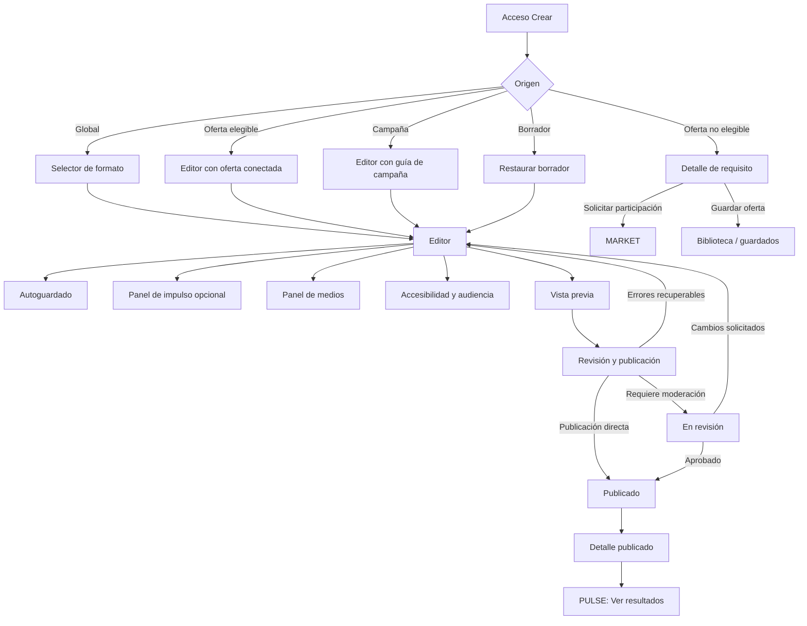

# STUDIO — Flujo detallado de UX/UI

**Producto:** Yellow Duxn  
**Módulo:** STUDIO, Estudio de Contenido  
**Versión:** Diseño UX/UI v1.0  
**Propósito:** Permitir que una persona cree, conecte, revise y publique contenido dentro de Yellow Duxn, con o sin una oferta o campaña asociada, sin abandonar la aplicación ni instalar herramientas adicionales.

> **Principio rector:** STUDIO no obliga a que el contenido sea comercial. Facilita la creación social normal y añade una capa de impulso solo cuando el usuario decide asociar una oferta, una campaña o una vitrina. Para el lanzamiento, **Flyer Express** es la acción inicial prioritaria: permite a personas sin experiencia de diseño crear flyers de servicios mediante plantillas guiadas, sin salir de Yellow Duxn.

## 1. Problema que resuelve y resultado deseado

STUDIO debe reducir el salto entre una idea de contenido y una publicación que puede generar impacto medible. En lugar de pedir al creador que abra un editor externo, copie un enlace, recuerde condiciones y luego vuelva a la red social, la herramienta centraliza ese recorrido en una superficie nativa y guiada.

El resultado mínimo de una sesión es uno de los siguientes: un borrador guardado, una publicación social publicada, una publicación comercial correctamente divulgada, una pieza en revisión o una publicación programada. Ninguna acción comercial se publica con un enlace inválido, una oferta no autorizada o una divulgación ausente.

| Objetivo UX | Comportamiento que lo demuestra |
|---|---|
| **Crear con rapidez** | Una publicación social simple se puede completar desde el acceso “Crear” sin pasar por ningún paso comercial. |
| **Promocionar con claridad** | Al asociar una oferta, STUDIO muestra condiciones, elegibilidad, enlace y divulgación en un mismo contexto. |
| **Conservar el control** | El usuario puede guardar, descartar, duplicar y previsualizar un borrador antes de publicar. |
| **Evitar errores recuperables** | El editor anticipa problemas, explica su causa y ofrece una acción concreta para resolverlos. |
| **Mantener continuidad** | Desde una oferta, una campaña o el feed, el usuario llega a STUDIO con el contexto relevante ya cargado. |

## 2. Usuarios, permisos y modos de trabajo

STUDIO adapta la interfaz al contexto y al permiso, no a etiquetas rígidas de rol. Una misma cuenta puede crear contenido social como miembro y, cuando cumple los requisitos, trabajar como afiliado o creador para una organización.

| Modo | Cómo llega el usuario | Capacidades visibles | Restricciones |
|---|---|---|---|
| **Publicación social** | Botón global “Crear” o feed. | Redactar, adjuntar medios, etiquetar, elegir audiencia, accesibilidad, vista previa y publicar. | No muestra campos de recompensa ni atribución. |
| **Impulso de oferta** | CTA “Crear contenido” en MARKET, oferta guardada o selector de impulso. | Todo lo anterior más resumen de oferta, enlace atribuido, CTA, divulgación y métricas posteriores. | Requiere elegibilidad y una oferta activa. |
| **Pieza de campaña** | CTA desde CAMPAIGNS, tarea o material aprobado. | Todo lo anterior más guía, material, fecha, restricciones y etiqueta de campaña. | Respeta la versión de condiciones y reglas de la campaña. |
| **Actualización de comunidad** | CTA desde COMMUNITY. | Formato de publicación comunitaria, etiquetas, recursos y audiencia del grupo. | Solo para miembros con permiso de publicar. |
| **Revisión/operaciones** | Cola de moderación o tarea administrativa. | Previsualización, políticas aplicables, decisión y comentario de resolución. | No permite modificar el borrador del creador. |

La comprobación de permisos ocurre al entrar, al adjuntar una entidad comercial y de nuevo antes de publicar. Si la condición cambia mientras la persona edita —por ejemplo, una oferta se pausa— STUDIO conserva el borrador, bloquea solo la acción incompatible y explica el siguiente paso.

## 3. Arquitectura de información

STUDIO se divide en dos espacios que comparten el mismo módulo: **Biblioteca**, para recuperar trabajo existente, y **Editor**, para crear o modificar una pieza. Un tercer espacio, **Plantillas**, solo se muestra cuando la funcionalidad está habilitada.

| Sección | Ruta propuesta | Contenido | Acciones primarias |
|---|---|---|---|
| **Inicio de STUDIO** | `/crear` | Acción prioritaria de Flyer Express, últimos borradores, contexto activo y avisos importantes. | Crear flyer para mi servicio, crear desde cero, continuar borrador. |
| **Biblioteca** | `/crear/biblioteca` | Filtros y lista de borradores, programados, publicados y archivados. | Abrir, duplicar, archivar, ver resultados. |
| **Plantillas** | `/crear/plantillas` | Plantillas propias, de campaña y aprobadas por marca. | Previsualizar, usar plantilla, guardar. |
| **Editor** | `/crear/:draftId` | Lienzo de creación, paneles contextuales, autoguardado y acciones de publicación. | Guardar, previsualizar, revisar y publicar. |
| **Detalle publicado** | `/crear/publicaciones/:contentId` | Estado, contenido, historial y enlace a PULSE. | Ver publicación, compartir, duplicar, ver resultados. |

### 3.1 Navegación global y local

Desde el shell de Yellow Duxn, el acceso “Crear” debe estar disponible como acción principal. Al abrir STUDIO, la barra superior conserva el regreso al contexto de origen, el indicador de guardado y un menú de más acciones. En escritorio, la biblioteca puede residir en una columna lateral; en móvil se representa como una vista de lista independiente para mantener el lienzo despejado.

| Elemento | Escritorio | Móvil |
|---|---|---|
| Acceso global | Botón destacado “Crear” en navegación principal. | Acción de creación visible en barra inferior o cabecera. |
| Regreso contextual | “← Oferta: Nombre de oferta” o “← Campaña: Nombre”. | Flecha de regreso y título truncado; conserva el contexto. |
| Biblioteca | Columna izquierda opcional con filtros y borradores recientes. | Ruta separada abierta desde “Borradores”. |
| Editor | Lienzo central con panel contextual a la derecha. | Lienzo a pantalla completa; paneles se abren como hojas inferiores. |
| Acciones de publicación | Barra fija superior: “Vista previa” y “Publicar”. | Barra fija inferior: “Vista previa” y “Siguiente/Publicar”. |

## 4. Puntos de entrada y contexto de llegada

El origen modifica la primera pantalla, pero nunca cambia la estructura central del editor. STUDIO muestra un aviso contextual persistente y permite volver a la fuente sin perder el trabajo.

| Origen | Estado inicial del editor | Aviso contextual | Acción de salida |
|---|---|---|---|
| **Crear global** | Borrador social vacío y selector de formato. | Ninguno; se ofrece “Añadir un impulso” de forma secundaria. | Volver al feed o guardar como borrador. |
| **Ficha de oferta** | Oferta seleccionada, elegibilidad comprobada y CTA sugerido. | “Creas contenido para: [Oferta]”. | Volver a la oferta. |
| **Campaña** | Campaña, tarea y material de la tarea precargados. | “Pieza para [Campaña] · Fecha límite: [fecha]”. | Volver a la campaña. |
| **Vitrina** | Oferta/colección elegida y formato de recomendación preconfigurado. | “Añadir contenido a tu vitrina”. | Volver a la vitrina. |
| **Comunidad** | Audiencia del grupo preseleccionada. | “Publicas en [Comunidad]”. | Volver a la comunidad. |
| **Borrador existente** | Recupera último estado y restauración de posición. | “Último cambio guardado: [hora]”. | Biblioteca. |

## 5. Mapa de navegación y estados UX

La máquina de estados del borrador evita que el creador pierda trabajo y determina qué acciones se muestran. Las transiciones se comunican con texto explícito, además de color e iconografía.

| Estado de pieza | Qué ve el usuario | Acciones permitidas | Siguiente estado posible |
|---|---|---|---|
| **Nueva** | Selector de formato y acceso rápido. | Empezar, usar plantilla, salir. | Borrador. |
| **Borrador guardando** | Indicador “Guardando…” sin bloquear el lienzo. | Continuar editando. | Borrador guardado o error recuperable. |
| **Borrador guardado** | Hora del último guardado y cambios pendientes claros. | Editar, previsualizar, descartar, duplicar, revisar. | Revisión o archivado. |
| **Listo para revisión** | Panel de comprobación con resultados. | Corregir, guardar, continuar a publicar. | Programado, en revisión o publicado. |
| **Programado** | Fecha, zona horaria y condiciones vigentes. | Editar, reprogramar, cancelar. | Borrador, publicado o bloqueado. |
| **En revisión** | Criterio aplicable, fecha de envío y estado. | Ver copia, retirar si las reglas lo permiten. | Publicado o cambios solicitados. |
| **Cambios solicitados** | Comentario de revisión y anclaje al área que requiere atención. | Corregir y reenviar. | Borrador guardado o en revisión. |
| **Publicado** | Vista de publicación, historial, divulgación y resultados iniciales. | Compartir, ver resultados, duplicar, archivar. | Archivado. |
| **Bloqueado por contexto** | Explicación de oferta, enlace o campaña no disponible. | Resolver desde el CTA sugerido o convertir a publicación social. | Borrador guardado o listo para revisión. |

## 6. Principios de interacción

El editor revela complejidad por etapas. Las acciones necesarias para una publicación social se muestran primero; la información comercial aparece solo después de elegir “Añadir impulso” o al entrar desde una oferta o campaña. La persona siempre puede entender qué cambiará antes de aceptar una acción irreversible, especialmente cuando el contenido pasa a revisión o publicación.

| Principio | Aplicación en STUDIO |
|---|---|
| **Divulgación progresiva** | Los paneles de atribución, campaña y revisión se abren solo cuando aportan valor al contexto actual. |
| **Autoguardado visible** | Guarda al pausar la edición y tras cambios significativos; el estado se anuncia sin interrumpir. |
| **Prevención antes que corrección** | Valida enlaces, elegibilidad, texto alternativo y campos obligatorios mientras se crea la pieza. |
| **Una acción principal por momento** | En el lienzo: “Continuar”; en la revisión: “Publicar ahora” o “Programar”; no ambas como acciones ambiguas. |
| **Reversibilidad** | Descartar, archivar, deshacer cambios locales y duplicar no destruyen el historial publicado. |
| **Transparencia comercial** | La divulgación y la condición de comisión se muestran cerca de la oferta, nunca ocultas en un menú secundario. |

---

**Continuación prevista:** Este documento se ampliará con la especificación visual de pantallas, componentes, microinteracciones, recorridos completos, accesibilidad y criterios de aceptación.

## 7. Sistema visual y composición de interfaz

STUDIO utiliza el sistema de diseño compartido de Yellow Duxn. Su tono visual debe favorecer concentración y seguridad: una superficie de creación limpia, controles explícitos y mensajes de estado situados cerca de la acción afectada. El color no puede ser la única señal de estado; cada aviso incluye icono, título y texto de apoyo.

| Token o patrón | Uso en STUDIO | Regla de aplicación |
|---|---|---|
| **Superficie de lienzo** | Área central de redacción, medios y vista previa. | Fondo neutro y alto contraste de lectura; no compite con el contenido. |
| **Color de acción principal** | Crear, continuar, publicar y confirmar. | Solo una acción primaria visible en cada punto de decisión. |
| **Color de impulso** | Oferta conectada, campaña y atribución. | Complementa, no sustituye, las etiquetas textuales “Oferta conectada” o “Campaña activa”. |
| **Estados semánticos** | Pendiente, advertencia, error, éxito y revisión. | Icono + texto + color; nunca solo una insignia de color. |
| **Panel lateral / hoja inferior** | Información contextual sin abandonar el borrador. | En escritorio, lateral derecho; en móvil, hoja inferior de foco único. |
| **Barra de acciones fija** | Guardado, previsualización y publicación. | Mantiene las acciones esenciales visibles sin tapar los campos activos. |

### 7.1 Retícula y jerarquía

En escritorio, el editor usa una retícula de tres zonas: contexto y biblioteca opcional a la izquierda, lienzo de trabajo en el centro y panel de ayuda/impulso a la derecha. El lienzo conserva una anchura de lectura cómoda y el panel derecho nunca se usa para campos indispensables de una publicación social básica.

| Zona | Ancho orientativo | Contenido | Comportamiento responsive |
|---|---:|---|---|
| Navegación/biblioteca | 240–280 px | Inicio, borradores, filtros y plantillas. | Se contrae a iconos o se convierte en ruta separada. |
| Lienzo | 560–760 px | Formato, medios, texto, audiencia y resumen. | Ocupa el ancho disponible a pantalla completa. |
| Panel contextual | 320–380 px | Oferta, campaña, ayuda y comprobaciones. | Se abre como hoja inferior modal desde una acción clara. |
| Barra superior | Altura fija | Regreso, estado de guardado y menú. | Mantiene solo volver, estado y más acciones. |
| Barra de decisión | Altura fija | Vista previa y siguiente/publicar. | Se fija al borde inferior y respeta área segura. |

## 8. Especificación de pantallas

### 8.1 S-01 — Inicio de STUDIO

La pantalla de inicio permite reanudar trabajo o empezar con una intención clara. No se convierte en un panel analítico: debe llevar a la acción en menos de unos segundos.

| Región | Elementos | Interacción |
|---|---|---|
| Cabecera | Título “Crear”, botón “Borradores”, menú de más opciones. | “Borradores” abre biblioteca con filtro `borrador`. |
| Acción primaria | Botón “Crear flyer para mi servicio”. | Abre Flyer Express, con objetivo y plantillas guiadas para personas sin conocimientos de diseño. |
| Acciones de contexto | “Crear desde cero”, “Promocionar una oferta”, “Material de campaña”. | Flyer Express es la ruta principal; las demás acciones se mantienen como accesos secundarios y abren el selector respectivo. |
| Continuar | Hasta tres tarjetas de borrador, con tipo, última edición y contexto. | Tocar cualquier parte abre el borrador; menú secundario permite duplicar o archivar. |
| Avisos | Oferta pausada, comentarios de revisión, tarea próxima a vencer o error de sincronización. | Cada aviso enlaza solo a la acción que puede resolverlo. |

**Estado vacío:** Cuando no existen borradores ni campañas, se muestra el mensaje “Promociona tu servicio con un flyer en pocos pasos” y dos acciones: “Crear flyer para mi servicio” y “Crear desde cero”. La creación general permanece disponible, pero Flyer Express concentra la ruta principal para personas sin experiencia de diseño.

### 8.2 S-02 — Selector de formato

El selector se abre solo para un borrador nuevo. Su propósito es definir la estructura inicial de la pieza, no imponer herramientas complejas antes de que el usuario tenga una idea.

| Tarjeta de formato | Descripción visible | Valores iniciales |
|---|---|---|
| **Publicación** | Texto e imagen, con una recomendación opcional. | Audiencia predeterminada; campo de texto enfocado. |
| **Carrusel** | Secuencia de imágenes o tarjetas para explicar una idea. | Primer panel vacío; indicador de número de piezas. |
| **Video breve** | Video vertical con título, descripción y portada. | Cargador de video; requisitos visibles antes de seleccionar archivo. |
| **Historia** | Actualización breve de duración limitada, si está habilitada. | Herramientas simplificadas y audiencia correspondiente. |
| **Recomendación** | Formato enfocado en una oferta o colección. | Abre selector de oferta al terminar de crear el borrador. |

Cada tarjeta incluye una mini-previsualización abstracta y una explicación de una línea. El formato se puede cambiar antes de publicar; si el cambio eliminaría medios incompatibles, STUDIO pide confirmación y permite duplicar el borrador como alternativa segura.

### 8.3 S-03 — Editor principal

Esta es la pantalla de trabajo principal. La interfaz separa el contenido de la configuración: el creador trabaja en el lienzo y abre paneles para medios, impulso, audiencia o accesibilidad cuando los necesita.

| Región | Contenido | Detalle de interacción |
|---|---|---|
| Barra superior | Volver, nombre del borrador editable, indicador de autoguardado, “Más”. | Al salir con cambios sin sincronizar, se mantiene localmente y se informa. |
| Contexto | Insignia de oferta/campaña si existe, con acción “Ver detalles”. | No ocupa espacio si el borrador es social. |
| Lienzo | Campo de texto con contador, bloques de medios, etiquetas y orden de piezas. | El foco permanece en el último campo editado después de cerrar un panel. |
| Compositor inferior | Añadir medio, oferta, enlace, etiqueta, ubicación opcional y audiencia. | Cada control tiene etiqueta accesible y abre una sola tarea por vez. |
| Panel lateral/hoja | Resumen de impulso, campaña, requisitos o inspección de medio. | Se cierra sin perder cambios; informa su estado en el botón de origen. |
| Barra de decisión | “Vista previa” secundaria y “Siguiente” o “Publicar” primaria. | La acción primaria cambia según faltan datos, revisión o configuración final. |

El campo de texto debe admitir texto enriquecido limitado y predecible: saltos de línea, menciones, etiquetas y enlaces. Los formatos que dificulten la accesibilidad o cambien de forma inesperada la presentación se excluyen del MVP.

### 8.4 S-04 — Panel de medios

El panel de medios permite añadir, ordenar y corregir archivos sin abandonar el texto. En escritorio aparece como panel lateral y en móvil como hoja inferior con el foco atrapado hasta cerrarse.

| Estado del medio | Presentación | Acción disponible |
|---|---|---|
| Sin archivos | Área de carga con “Elegir archivo” y “Soltar aquí” en escritorio. | Seleccionar desde dispositivo o biblioteca autorizada. |
| Cargando | Miniatura provisional, porcentaje y “Cancelar”. | Cancelar sin afectar los demás medios. |
| Procesando | Indicador “Preparando para publicar”. | Continuar editando otras áreas; se bloquea publicar solo si el medio es esencial. |
| Listo | Miniatura, orden, texto alternativo/portada y menú de opciones. | Reordenar, reemplazar, recortar si la función existe, eliminar. |
| Con error | Motivo específico, por ejemplo formato no admitido o carga interrumpida. | Reintentar, reemplazar o eliminar. |

Para imágenes, STUDIO solicita texto alternativo cuando se trate de una publicación pública. Para videos, solicita título descriptivo y ofrece un campo para subtítulos cuando esa capacidad esté disponible. La persona puede marcar un medio como decorativo solo si no comunica información esencial.

### 8.5 S-05 — Panel “Añadir impulso”

El panel de impulso es el núcleo comercial de STUDIO. Se abre por decisión explícita del usuario o se muestra ya conectado cuando llega desde MARKET o CAMPAIGNS. En ningún caso se transforma un contenido social en comercial de forma silenciosa.

| Subvista | Información | Acción principal |
|---|---|---|
| **Buscar oferta** | Buscador, guardados, campañas activas y filtros de elegibilidad. | Seleccionar oferta. |
| **Resumen de oferta** | Marca, producto, recompensa explicada, duración de atribución, restricciones y estado de elegibilidad. | “Conectar a este contenido”. |
| **Atribución** | Enlace, código o CTA asignado; canal y nombre interno si aplica. | “Usar este enlace” o “Generar enlace”. |
| **Divulgación** | Texto de transparencia recomendado y explicación de dónde se verá. | “Añadir divulgación”. |
| **Comprobación** | Oferta activa, solicitud aprobada, enlace válido y requisitos de campaña. | “Aplicar al borrador”. |

Al conectar una oferta, se insertan tres señales claras en el editor: la insignia “Oferta conectada”, una tarjeta de CTA editable con campos permitidos y una divulgación comercial visible en la vista previa. El usuario puede quitar la oferta; STUDIO pregunta si desea mantener el texto, el CTA y la divulgación como contenido normal o retirar esos elementos automáticamente.

| Resultado de elegibilidad | Tratamiento UX |
|---|---|
| Elegible | Permite conectar la oferta y crear/usar un enlace. |
| Requiere solicitud | Muestra requisitos, botón “Solicitar participación” y guarda el borrador sin perder el contexto. |
| Solicitud pendiente | Explica que no se puede generar enlace hasta la aprobación; permite seguir editando como borrador. |
| Oferta pausada o vencida | Prohíbe la conexión; ofrece volver a MARKET y guardar la pieza como borrador social. |
| Restricción regional o de audiencia | Explica la condición de forma legible, sin exponer información privada de terceros. |

### 8.6 S-06 — Panel de campaña

Cuando una pieza se origina en CAMPAIGNS, este panel es visible de forma resumida y se puede ampliar. Su función es ayudar a cumplir la tarea, no convertir la campaña en una barrera opaca.

| Bloque | Contenido | Comportamiento |
|---|---|---|
| Resumen | Nombre, marca, tarea, fecha límite y obligatoriedad. | Permanece visible como aviso contextual compacto. |
| Guía creativa | Mensajes clave, tono, recursos y ejemplos autorizados. | Los enlaces se abren en vista interna o pestaña controlada sin perder el borrador. |
| Requisitos | Etiquetas, divulgaciones, CTA, duración, formatos y restricciones. | Cada regla se convierte en elemento de la lista de revisión. |
| Materiales | Medios y textos aprobados. | Añadir un material crea una copia en el borrador; no edita el original. |
| Contacto | Canal de preguntas de la campaña cuando exista. | Abre mensajería contextual, no expone datos personales. |

### 8.7 S-07 — Audiencia, accesibilidad y configuración

Este panel reúne decisiones de publicación que afectan el alcance y la comprensión de la pieza. Se divide en secciones para evitar una pantalla excesivamente densa.

| Sección | Campos | Validación |
|---|---|---|
| **Audiencia** | Pública, seguidores, comunidad específica o audiencia de campaña. | La opción inválida se explica y no puede seleccionarse. |
| **Etiquetas** | Personas, temas y comunidades permitidas. | Previene menciones no autorizadas según configuración de privacidad. |
| **Accesibilidad** | Texto alternativo, descripciones, subtítulos y declaración de medio decorativo. | Muestra lo pendiente antes de la revisión. |
| **Visibilidad comercial** | Divulgación, CTA y etiqueta de contenido promocional. | No permite ocultar la divulgación requerida. |
| **Programación** | Fecha, hora y zona horaria. | Verifica que la oferta y campaña sigan activas en la hora prevista. |

### 8.8 S-08 — Vista previa

La vista previa presenta el contenido como lo verá el público objetivo, con un selector de formato para escritorio y móvil. No es una captura estática: conserva enlaces operables en modo seguro y permite regresar al punto exacto del editor.

| Elemento | Requisito UX |
|---|---|
| Encabezado de vista previa | Identifica la audiencia, el dispositivo simulado y si la pieza incluye impulso comercial. |
| Contenido | Representa orden, recortes, CTA, oferta conectada y divulgación con la jerarquía real de publicación. |
| Comprobaciones | Lista colapsable de elementos completos y pendientes; un clic devuelve al campo correspondiente. |
| Navegación | “Volver a editar” conserva foco y desplazamiento; “Continuar” abre la revisión final. |
| Modo seguro | Los enlaces de compra o afiliación no completan acciones externas desde la vista previa. |

### 8.9 S-09 — Revisión y publicación

La pantalla de revisión convierte requisitos técnicos y comerciales en una lista comprensible. El usuario debe saber qué ocurrirá al publicar y por qué una pieza puede pasar a moderación.

| Bloque | Contenido | Resultado |
|---|---|---|
| **Resumen** | Formato, audiencia, oferta/campaña, fecha de publicación y última edición. | Contexto completo antes de confirmar. |
| **Lista de revisión** | Medios listos, texto alternativo, divulgación, CTA, enlace, permisos, políticas y programación. | Cada fallo es accionable y anclado a su origen. |
| **Avisos no bloqueantes** | Sugerencias de claridad, longitud o legibilidad. | Se pueden ignorar conscientemente; no se presentan como errores. |
| **Decisión final** | Publicar ahora, programar o guardar como borrador. | Solo la opción aplicable aparece como acción principal. |
| **Confirmación** | Mensaje de éxito con los estados “Publicado” o “En revisión”. | Dirige a ver publicación, compartir o volver al inicio. |

Si la publicación requiere revisión, el botón dice **“Enviar a revisión”**, nunca “Publicar”. El cuadro de confirmación explica que la pieza no será visible todavía, qué criterio la activa y cómo se notificará la resolución.

### 8.10 S-10 — Biblioteca y detalle publicado

La biblioteca facilita recuperar trabajo sin convertirlo en una lista difícil de explorar. El detalle publicado permite cerrar el ciclo de creación y aprender de los resultados.

| Vista | Elementos | Acciones |
|---|---|---|
| **Biblioteca** | Filtros de estado, tipo, contexto, fecha; búsqueda por título; tarjetas/lista. | Abrir, duplicar, archivar, eliminar solo borradores vacíos, ver resultados de publicados. |
| **Detalle publicado** | Publicación, estado de difusión, divulgación, oferta/campaña, historial y vínculo a métricas. | Compartir, duplicar, archivar y “Ver resultados”. |
| **Historial** | Creación, cambios relevantes, envío a revisión, publicación, modificaciones de contexto. | Solo lectura; cada evento tiene fecha y actor cuando corresponda. |

## 9. Componentes reutilizables y reglas de interacción

| Componente | Anatomía | Estados | Regla clave |
|---|---|---|---|
| **Indicador de guardado** | Icono, texto y hora. | Guardando, guardado, sin conexión, error. | Nunca se limita a un icono sin texto. |
| **Tarjeta de oferta conectada** | Marca, nombre, estado, recompensa explicada, CTA y menú quitar. | Activa, pendiente, pausada, no elegible. | Pausar o perder elegibilidad bloquea la publicación comercial, no borra el borrador. |
| **Lista de comprobación** | Icono de estado, título, explicación y CTA. | Completo, advertencia, bloqueante. | El CTA lleva al campo exacto y conserva el resto del trabajo. |
| **Selector de audiencia** | Etiqueta, valor activo, descripción y ayuda. | Disponible, restringida, requerida. | No se cambia silenciosamente al conectar campaña. |
| **Adjunto de medio** | Miniatura, etiqueta, carga, menú y metadatos accesibles. | Cargando, listo, procesando, error. | Reordenar es accesible mediante botones alternativos, no solo arrastre. |
| **Divulgación comercial** | Etiqueta, texto de divulgación y enlace de explicación. | Aplicada, pendiente, obligatoria. | Visible en la vista previa donde la verá la audiencia. |
| **Confirmación destructiva** | Título, consecuencia, acciones conservar/descartar. | Abierta, procesando, error. | “Conservar borrador” es la acción segura por defecto. |
| **Hoja inferior móvil** | Título, cerrar, contenido desplazable y acción fija. | Abierta, cargando, error. | Mantiene foco y se cierra con gesto, botón o Escape equivalente. |

### 9.1 Microinteracciones esenciales

| Disparador | Respuesta de interfaz | Duración/resultado |
|---|---|---|
| Pausa breve al editar | Se inicia autoguardado silencioso. | “Guardando…” cambia a “Guardado hace un instante”. |
| Enlace pegado | STUDIO analiza destino y ofrece asociarlo a oferta si procede. | Nunca lo convierte a enlace de afiliación automáticamente. |
| Oferta conectada | El resumen de impulso se expande una vez y vuelve a minimizarse. | El creador conserva el control del lienzo. |
| Requisito incompleto | La barra de decisión muestra contador de pendientes. | Un clic abre lista de comprobación, no un mensaje genérico. |
| Publicación completada | Confirmación breve con animación no esencial. | Se ofrece una acción clara según el estado final. |
| Error de red | Aviso persistente no intrusivo y reintento automático seguro. | No se oculta hasta sincronizar o recibir una decisión del usuario. |

## 10. Recorridos detallados de experiencia

### 10.1 Flujo A — Publicación social rápida

Este recorrido protege la simplicidad del caso más habitual: compartir una idea sin interés comercial. El módulo no debe mostrar una oferta obligatoria ni introducir pasos adicionales que impidan publicar.

| Paso | Pantalla/estado | Acción de la persona | Respuesta de STUDIO | Criterio de salida |
|---:|---|---|---|---|
| 1 | Feed o navegación | Pulsa “Crear”. | Crea borrador y abre S-02. | Se visualizan formatos disponibles. |
| 2 | Selector de formato | Selecciona “Publicación”. | Abre S-03 con campo de texto enfocado. | Puede escribir inmediatamente. |
| 3 | Editor | Redacta y adjunta una imagen. | Autoguarda; procesa el medio sin bloquear el texto. | Medio listo y texto guardado. |
| 4 | Editor | Define texto alternativo. | Marca accesibilidad como completa. | Comprobación actualizada. |
| 5 | Editor | Ajusta audiencia a “Seguidores”. | Resume la audiencia en la barra de contexto. | Configuración válida. |
| 6 | Vista previa | Pulsa “Vista previa”. | Representa la pieza para la audiencia elegida. | Contenido revisado. |
| 7 | Revisión | Pulsa “Publicar ahora”. | Valida campos y registra la publicación. | Se muestra S-10 en estado publicado. |
| 8 | Detalle publicado | Elige “Ver publicación” o “Compartir”. | Conserva vínculo a la pieza y al historial. | Flujo concluido sin pasos comerciales. |

**Punto de recuperación:** Si la persona sale en los pasos 2 a 6, STUDIO conserva el borrador. Si intenta descartarlo, se ofrece “Conservar borrador” como opción segura y “Descartar” como acción secundaria claramente descrita.

### 10.2 Flujo B — Crear contenido para una oferta elegible

Este recorrido se inicia desde MARKET o desde el panel de impulso. La persona conoce el contexto económico antes de escribir y puede publicar solo después de que STUDIO confirme oferta, elegibilidad, enlace y divulgación.

| Paso | Pantalla/estado | Acción de la persona | Respuesta de STUDIO | Regla de confianza |
|---:|---|---|---|---|
| 1 | Ficha de oferta | Pulsa “Crear contenido”. | Comprueba elegibilidad y crea borrador con la oferta conectada. | Muestra condiciones y versión vigente. |
| 2 | S-03 Editor | Revisa la tarjeta de oferta y abre “Ver detalles”. | Muestra recompensa, restricción, vigencia y política de atribución. | No presenta ingresos como garantizados. |
| 3 | S-03 Editor | Redacta pieza y añade medios. | Autoguarda y verifica medios. | El contenido sigue siendo propiedad del creador. |
| 4 | S-05 Impulso | Revisa o genera enlace atribuido. | Asocia un identificador válido a la oferta y al borrador. | El enlace no expone datos de terceros. |
| 5 | S-05 Impulso | Acepta el texto de divulgación propuesto o lo personaliza dentro de reglas. | Inserta la divulgación cerca del CTA en la vista previa. | No permite ocultarla si es requerida. |
| 6 | S-07 Configuración | Elige audiencia y, si aplica, programación. | Verifica compatibilidad de audiencia, oferta y vigencia. | Bloquea programar después del vencimiento. |
| 7 | S-08 Vista previa | Simula vista móvil o escritorio. | Muestra etiqueta comercial, CTA y destino seguro. | La divulgación es visible antes de publicar. |
| 8 | S-09 Revisión | Corrige pendientes y pulsa “Publicar ahora”. | Revalida la oferta y el enlace en tiempo real. | Evita publicar contra reglas desactualizadas. |
| 9 | Confirmación | Recibe “Publicado” o “Enviado a revisión”. | Ofrece compartir, ver publicación o regresar a inicio. | El resultado no confunde revisión con publicación. |
| 10 | S-10 Detalle | Pulsa “Ver resultados”. | Abre PULSE con filtro de contenido y oferta. | Las métricas diferencian clics y conversiones confirmadas. |

**Desviación: oferta pausada entre la edición y la publicación.** STUDIO conserva toda la pieza y presenta una tarjeta bloqueante: “Esta oferta ya no acepta nuevas promociones”. Ofrece tres decisiones: volver a la oferta, quitar el impulso y publicar como contenido social —después de revisar la divulgación y el CTA— o guardar el borrador. Nunca sustituye automáticamente una oferta por otra.

### 10.3 Flujo C — Cumplir una tarea de campaña

Este recorrido asegura que los materiales y restricciones de la campaña acompañen al creador sin ocultar su autonomía editorial ni mezclar las campañas con su billetera personal.

| Paso | Momento | Diseño y comportamiento |
|---:|---|---|
| 1 | Entrada desde tarea | CAMPAIGNS crea un borrador con nombre de campaña, tarea, formato aconsejado y fecha límite. |
| 2 | Contexto de campaña | Un aviso compacto confirma la campaña; el panel S-06 permite ampliar guía, recursos y requisitos. |
| 3 | Uso de materiales | El creador añade archivos o textos aprobados como copias editables; el original se conserva. |
| 4 | Creación | El lienzo mantiene texto, medios y enfoque creativo en manos de la persona. |
| 5 | Comprobación | La lista de revisión convierte requisitos de campaña en elementos verificables: etiqueta, CTA, fecha, divulgación y audiencia. |
| 6 | Publicación | Si la campaña exige aprobación, el CTA dice “Enviar a revisión”; si no, permite publicar o programar. |
| 7 | Resolución | STUDIO notifica aprobación, cambios solicitados o expiración de la tarea y registra el historial. |

**Desviación: fecha de la tarea vencida.** Si el creador abre un borrador después de la fecha, STUDIO muestra el contexto como vencido. El contenido sigue siendo editable y duplicable, pero no puede presentarse como cumplimiento de esa tarea a menos que CAMPAIGNS la reabra explícitamente.

### 10.4 Flujo D — Oferta no elegible o solicitud pendiente

La ineligibilidad no debe parecer un error técnico. STUDIO explica el estado en lenguaje sencillo, preserva la idea creativa y dirige a la acción legítima que corresponde.

| Estado recibido desde MARKET | Mensaje en STUDIO | Acción primaria | Alternativas seguras |
|---|---|---|---|
| Requiere solicitud | “Esta oferta necesita aprobación antes de generar un enlace.” | “Solicitar participación”. | Guardar borrador; explorar otra oferta. |
| Solicitud pendiente | “Tu solicitud está en revisión. Aún no puedes usar un enlace de comisión.” | “Ver solicitud”. | Continuar como borrador social sin CTA comercial. |
| Rechazada | “No cumples los requisitos de esta oferta en este momento.” | “Ver requisitos”. | Guardar, quitar impulso o explorar alternativas. |
| Restricción regional | “Esta oferta no está disponible para la audiencia o región seleccionada.” | “Cambiar audiencia” o “Ver oferta”. | Quitar oferta sin perder el contenido. |
| Cuenta incompleta | “Completa [requisito] para poder promover esta oferta.” | “Completar perfil”. | Guardar y continuar con publicación social. |

### 10.5 Flujo E — Cambios solicitados por revisión

Una resolución de moderación debe ser específica, respetuosa y editable. STUDIO no marca toda la publicación como “incorrecta” si la corrección se limita a una divulgación o una afirmación concreta.

| Paso | Experiencia |
|---:|---|
| 1 | La notificación conduce al borrador en estado “Cambios solicitados”. |
| 2 | Un resumen superior muestra el criterio, la fecha y el texto de la resolución. |
| 3 | La lista de comprobación marca los elementos afectados y cada CTA desplaza el lienzo al campo exacto. |
| 4 | El usuario corrige, revisa la vista previa y elige “Reenviar a revisión”. |
| 5 | STUDIO conserva el historial de versión y muestra “En revisión” sin prometer un resultado. |

### 10.6 Flujo F — Trabajo sin conexión y recuperación de sincronización

STUDIO debe permitir mantener el proceso creativo cuando la conexión es intermitente, sin dar a entender que una publicación ya se guardó en el servidor si todavía está en espera.

| Situación | Señal visible | Comportamiento seguro |
|---|---|---|
| Pérdida de conexión | Franja “Sin conexión. Tus cambios se guardan en este dispositivo.” | Conserva cambios locales y deshabilita publicar/programar. |
| Conexión restablecida | Indicador “Sincronizando cambios…”. | Sincroniza en orden y muestra hora de última sincronización. |
| Conflicto de edición | Cuadro “Hay una versión más reciente”. | Permite comparar, conservar local, usar servidor o duplicar. |
| Error de carga de medio | Miniatura con motivo y reintento. | El texto y demás medios permanecen guardados. |
| Reintento de publicación | Estado “Comprobando publicación anterior…”. | Usa idempotencia; no duplica la pieza si la primera solicitud sí llegó. |

## 11. Accesibilidad e inclusión

STUDIO debe ser plenamente operable sin ratón, comprensible mediante lector de pantalla y usable en móvil con distintos modos de interacción. Estos criterios se aplican a la experiencia publicada y a las herramientas internas de revisión.

| Necesidad | Requisito de diseño | Verificación |
|---|---|---|
| Navegación por teclado | Orden de foco lógico desde cabecera a lienzo, paneles y barra de decisión; atajos documentados no sustituyen controles visibles. | Se completa el flujo A sin usar puntero. |
| Lectores de pantalla | Estructura semántica, etiquetas asociadas, nombres accesibles de iconos y mensajes de estado anunciados con prioridad adecuada. | Se entiende qué se guardó, qué falta y qué acción se activó. |
| Contraste y color | Información crítica acompañada de texto e icono; estados legibles con contraste suficiente en temas claro y oscuro. | Un estado no se interpreta solo por su color. |
| Medios | Texto alternativo para imágenes significativas, descripciones, portada explicativa y subtítulos o transcripción cuando el formato lo exija. | La revisión no permite omitir un requisito marcado como obligatorio. |
| Movimiento | Respeta preferencia de movimiento reducido; animaciones de éxito no son necesarias para entender el resultado. | Las acciones principales siguen siendo claras sin animación. |
| Tamaño y toque | Controles táctiles espaciados y zonas de toque previsibles; no se depende solo de arrastrar. | Reordenar medios puede hacerse con acciones “Mover arriba/abajo”. |
| Lenguaje | Instrucciones breves, sin jerga financiera ni mensajes de culpa; se aclaran las consecuencias de cada decisión. | Usuarios identifican si una pieza está publicada, en revisión o bloqueada. |
| Errores | Resumen de errores al comienzo de la revisión y enlaces directos a cada campo. | El foco se mueve al primer error solo cuando el usuario lo solicita o confirma publicar. |

### 11.1 Reglas de foco, diálogos y anuncios

Al abrir un panel lateral o una hoja inferior, el foco va al título del panel. Al cerrarlo, vuelve al control que lo abrió. Los diálogos de confirmación atrapan el foco temporalmente, describen la consecuencia y ofrecen una forma evidente de cancelar. Los avisos de autoguardado son anuncios discretos; los errores de publicación, cambio de estado de revisión y pérdida de conexión requieren un anuncio más visible y persistente.

## 12. Estados de error y contenido de interfaz

Los mensajes deben explicar qué ocurrió, qué se conserva y qué puede hacer la persona. Evitar “Error 500”, “Operación fallida” o textos que deleguen la corrección en el usuario sin orientación.

| Situación | Título | Texto de apoyo | Acción principal |
|---|---|---|---|
| No se pudo guardar | “No pudimos guardar todos tus cambios” | “Tu trabajo sigue abierto. Comprueba tu conexión y vuelve a intentarlo.” | “Reintentar guardado”. |
| Enlace inválido | “Este enlace ya no se puede usar” | “La oferta o el enlace cambió. Genera uno nuevo antes de publicar.” | “Generar enlace”. |
| Falta divulgación | “Añade la divulgación comercial” | “Las personas deben saber que esta publicación está vinculada a una oferta.” | “Añadir divulgación”. |
| Medio sin descripción | “Describe esta imagen” | “El texto alternativo ayuda a que más personas entiendan tu publicación.” | “Añadir texto alternativo”. |
| Oferta pausada | “La oferta está pausada” | “No se permiten nuevas promociones mientras esté pausada. Tu borrador se conserva.” | “Ver oferta”. |
| Revisión pendiente | “Tu publicación está en revisión” | “Todavía no es visible. Te avisaremos cuando haya una resolución.” | “Ver detalles”. |
| Cambios solicitados | “Necesita algunos ajustes” | “Revisa los elementos marcados y reenvía la publicación cuando estén listos.” | “Revisar cambios”. |

## 13. Criterios de aceptación UX/UI

| ID | Criterio | Evidencia de aceptación |
|---|---|---|
| UX-01 | Una publicación social se crea sin seleccionar oferta, campaña ni enlace. | Prueba de flujo A completada en escritorio y móvil. |
| UX-02 | Un borrador conserva cambios al cerrar STUDIO, perder conexión o recibir un fallo temporal. | Prueba de guardado y recuperación con indicador de estado correcto. |
| UX-03 | STUDIO no permite publicar contenido comercial con oferta inactiva, ineligibilidad, enlace inválido o divulgación requerida ausente. | Casos negativos bloqueados con CTA de resolución específico. |
| UX-04 | Una pieza originada en campaña muestra su tarea, requisitos y fecha sin impedir la edición creativa. | Prueba de flujo C y panel S-06. |
| UX-05 | Los errores de revisión se enlazan a campos concretos y permiten reenvío sin rehacer el borrador. | Prueba de flujo E con historial de versiones. |
| UX-06 | Los componentes prioritarios se operan con teclado y se anuncian correctamente mediante lector de pantalla. | Prueba manual de flujo A y B sin puntero. |
| UX-07 | Las acciones de publicación distinguen visual y textualmente “Publicar”, “Programar” y “Enviar a revisión”. | Revisión de S-09 en todos los estados de política. |
| UX-08 | En móvil, los paneles contextuales no ocultan la barra de decisiones ni eliminan el foco de la tarea actual. | Prueba de hojas inferiores y retorno de foco. |
| UX-09 | Al pausarse una oferta, el contenido se conserva y el usuario decide entre resolver, quitar impulso o guardar. | Prueba de desviación del flujo B. |
| UX-10 | El detalle publicado vincula a PULSE sin mostrar la comisión como ingreso garantizado. | Prueba de navegación y microcopy del estado. |

## 14. Analítica de experiencia para mejorar STUDIO

Las métricas de producto se recogen de forma agregada y con controles de privacidad. Se usan para identificar fricción en el flujo, no para inferir la calidad individual del creador ni mostrar datos personales a marcas o comunidades.

| Evento UX | Propiedad mínima | Pregunta que responde |
|---|---|---|
| `studio.entry_opened` | origen, modo, formato inicial | ¿Desde dónde llegan las personas a STUDIO? |
| `studio.draft_saved` | tipo, modo, estado de conexión | ¿Se conservan los avances de manera confiable? |
| `studio.offer_panel_opened` | origen de apertura | ¿Cuándo se decide añadir un impulso? |
| `studio.eligibility_blocked` | categoría de bloqueo, no datos sensibles | ¿Qué reglas impiden más publicaciones? |
| `studio.preview_opened` | formato, modo | ¿Las personas revisan antes de publicar? |
| `studio.publish_attempted` | modo, resultado, categoría de bloqueo | ¿Dónde se concentran los pendientes? |
| `studio.content_published` | formato, modo, directo/en revisión | ¿Qué recorridos concluyen satisfactoriamente? |
| `studio.draft_abandoned` | último paso, con ventana de tiempo agregada | ¿Qué pantalla necesita simplificación? |

## 15. Handoff de diseño a producto y desarrollo

Para convertir este flujo en pantallas de alta fidelidad o en un prototipo funcional, el equipo debe mantener el vínculo entre cada decisión visual, los permisos del módulo y los contratos de integración ya definidos para STUDIO. El flujo no debe implementarse como un formulario estático: necesita autoguardado, verificación de contexto y estados que reflejen la disponibilidad real de MARKET, LINKS, CAMPAIGNS y moderación.

| Entregable de siguiente nivel | Insumo de este documento | Resultado esperado |
|---|---|---|
| Wireframes de alta fidelidad | Secciones 7–9, retícula y pantallas S-01 a S-10. | Sistema de pantallas consistente para escritorio y móvil. |
| Prototipo navegable | Secciones 5 y 10. | Recorridos A, B, C y E demostrables antes de desarrollo. |
| Especificación frontend | Componentes de sección 9 y criterios UX-01 a UX-10. | Estados, props y pruebas de interfaz definidos. |
| Especificación backend | Estados de sección 5, elegibilidad y flujos de publicación. | Contratos para borradores, enlaces, moderación y publicación. |
| Plan de investigación | Eventos de sección 14 y recorridos prioritarios. | Pruebas moderadas con creadores, afiliados y marcas. |

---

## Resumen de decisión UX/UI

STUDIO se diseña como un editor nativo, simple para una publicación social y guiado cuando existe una intención comercial. La interfaz separa el contenido del contexto de impulso, conserva siempre el trabajo del creador y exige transparencia antes de publicar. La modularidad sucede detrás de la experiencia: el creador trabaja en un único flujo de Yellow Duxn, mientras STUDIO valida con MARKET, LINKS, CAMPAIGNS, TRUST y PULSE de forma explícita y comprensible.
